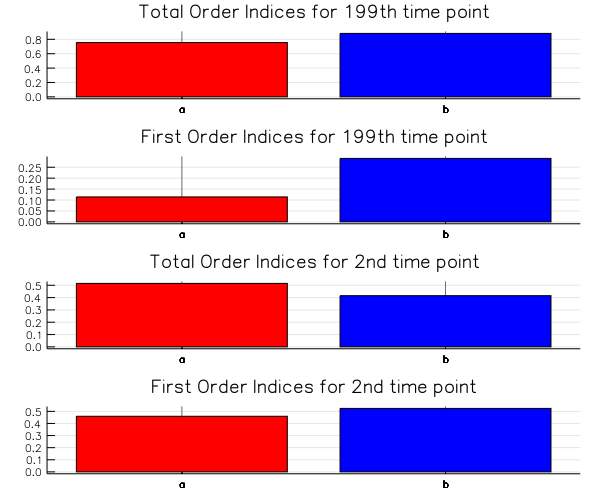

# [Global Sensitivity Analysis] (@id gsa)

Global Sensitivity Analysis (GSA) methods are used to quantify the uncertainty in
output of a model w.r.t. the parameters, their individual contributions, or the
contribution of their interactions. The GSA interface allows for utilizing batched
functions for parallel computation of GSA quantities.

## Installation

This functionality does not come standard with DifferentialEquations.jl.
To use this functionality, you must install DiffEqSensitivity.jl:

```julia
]add DiffEqSensitivity
using DiffEqSensitivity
```

## General Interface

The general interface for calling a global sensitivity analysis is either:

```julia
effects = gsa(f, method, param_range; N, batch=false)
```

where:

- `y=f(x)` is a function that takes in a single vector and spits out a single vector or scalar.
  If `batch=true`, then `f` takes in a matrix where each row is a set of parameters,
  and returns a matrix where each row is a the output for the corresponding row of parameters.
- `method` is one of the GSA methods below.
- `param_range` is a vector of tuples for the upper and lower bound for the given parameter `i`.
- `N` is a required keyword argument for the number of samples to take in the trajectories/design.

Note that for some methods there is a second interface where one can directly pass the design matrices:

```julia
effects = gsa(f, method, A, B; batch=false)
```

where `A` and `B` are design matrices with each row being a set of parameters. Note that `generate_design_matrices`
from [QuasiMonteCarlo.jl](https://github.com/JuliaDiffEq/QuasiMonteCarlo.jl) can be used to generate the design
matrices.

### Morris Method

`Morris` has the following keyword arguments:

- `p_steps` - Vector of ``\Delta`` for the step sizes in each direction. Required.
- `relative_scale` - The elementary effects are calculated with the assumption that
  the parameters lie in the range `[0,1]` but as this is not always the case
  scaling is used to get more informative, scaled effects. Defaults to `false`.
- `total_num_trajectory`, `num_trajectory` - The total number of design matrices that are
  generated out of which `num_trajectory` matrices with the highest spread are used in calculation.
- len_design_mat` - The size of a design matrix.

#### Morris Method Details

The Morris method also known as Morris’s OAT method where OAT stands for
One At a Time can be described in the following steps:

We calculate local sensitivity measures known as “elementary effects”,
which are calculated by measuring the perturbation in the output of the
model on changing one parameter.

``EE_i = \frac{f(x_1,x_2,..x_i+ \Delta,..x_k) - y}{\Delta}``

These are evaluated at various points in the input chosen such that a wide
“spread” of the parameter space is explored and considered in the analysis,
to provide an approximate global importance measure. The mean and variance of
these elementary effects is computed. A high value of the mean implies that
a parameter is important, a high variance implies that its effects are
non-linear or the result of interactions with other inputs. This method
does not evaluate separately the contribution from the
interaction and the contribution of the parameters individually and gives the
effects for each parameter which takes into consideration all the interactions and its
individual contribution.

### Sobol Method

The `Sobol` object has as its fields the `order` of the indices to be estimated.

- `order` - the order of the indices to calculate. Defaults to `[0,1]`, which means the
  Total and First order indices. Passing `2` enables calculation of the Second order indices as well.
- `Ei_estimator` - Can take `:Homma1996`, `:Sobol2007` and `:Jansen1999` for which
  Monte Carlo estimator is used for the Ei term. Defaults to `:Jansen1999`.

#### Sobol Method Details

Sobol is a variance-based method and it decomposes the variance of the output of
the model or system into fractions which can be attributed to inputs or sets
of inputs. This helps to get not just the individual parameter's sensitivities
but also gives a way to quantify the affect and sensitivity from
the interaction between the parameters.

```math
 Y = f_0+ \sum_{i=1}^d f_i(X_i)+ \sum_{i < j}^d f_{ij}(X_i,X_j) ... + f_{1,2...d}(X_1,X_2,..X_d)
```

```math
 Var(Y) = \sum_{i=1}^d V_i + \sum_{i < j}^d V_{ij} + ... + V_{1,2...,d}
```

The Sobol Indices are "order"ed, the first order indices given by ``S_i = \frac{V_i}{Var(Y)}``
the contribution to the output variance of the main effect of `` X_i ``, therefore it
measures the effect of varying `` X_i `` alone, but averaged over variations
in other input parameters. It is standardised by the total variance to provide a fractional contribution.
Higher-order interaction indices `` S_{i,j}, S_{i,j,k} `` and so on can be formed
by dividing other terms in the variance decomposition by `` Var(Y) ``.

### eFAST Method

`eFAST` has `num_harmonics` as the only argument, it is the number of harmonics to sum in 
the Fourier series decomposition and defaults to 4.

#### eFAST Method Details

eFAST offers a robust, especially at low sample size, and computationally efficient procedure to 
get the first and total order indices as discussed in Sobol. It utilizes monodimensional Fourier decomposition
along a curve exploring the parameter space. The curve is defined by a set of parametric equations,
```math
x_{i}(s) = G_{i}(sin ω_{i}s), ∀ i=1,2 ,..., n,
```
where s is a scalar variable varying over the range ``-∞ < s < +∞``, ``G_{i}`` are transformation functions
and ``{ω_{i}}, ∀ i=1,2,...,n`` is a set of different (angular) frequencies, to be properly selected, associated with each factor.
For more details on the transformation used and other implementation details you can go through [ A. Saltelli et al.](http://dx.doi.org/10.1080/00401706.1999.10485594).


### Regression Method

`RegressionGSA` has the following keyword arguments:

- `rank`: flag which determines whether to calculate the rank coefficients. Defaults to `false`.

It returns a `RegressionGSAResult`, which contains the `pearson`, `standard_regression`, and
`partial_correlation` coefficients, described below. If `rank` is true, then it also contains the ranked
versions of these coefficients. Note that the ranked version of the `pearson` coefficient is
also known as the Spearman coefficient, which is returned here as the `pearson_rank` coefficient.

For multi-variable models, the coefficient for the `` X_i `` input variable relating to the
`` Y_j `` output variable is given as the `[i, j]` entry in the corresponding returned matrix.

#### Regression Details

It is possible to fit a linear model explaining the behavior of Y given the
values of X, provided that the sample size n is sufficiently large (at least n > d).

The measures provided for this analysis by us in DiffEqSensitivity.jl are

  a) Pearson Correlation Coefficient:

```math
r = \frac{\sum_{i=1}^{n} (x_i - \overline{x})(y_i - \overline{y})}{\sqrt{\sum_{i=1}^{n} (x_i - \overline{x})^2(y_i - \overline{y})^2}}
```

  b) Standard Regression Coefficient (SRC):

```math
SRC_j = \beta_{j} \sqrt{\frac{Var(X_j)}{Var(Y)}}
```

where ``\beta_j`` is the linear regression coefficient associated to $X_j$. This is also known
as a sigma-normalized derivative.

  c) Partial Correlation Coefficient (PCC):

```math
PCC_j = \rho(X_j - \hat{X_{-j}},Y_j - \hat{Y_{-j}})
```

where ``\hat{X_{-j}}`` is the prediction of the linear model, expressing ``X_{j}``
with respect to the other inputs and ``\hat{Y_{-j}}`` is the prediction of the
linear model where ``X_j`` is absent. PCC measures the sensitivity of ``Y`` to
``X_j`` when the effects of the other inputs have been canceled.

If `rank` is set to `true`, then the rank coefficients are also calculated.

## GSA examples

### Lotka-Volterra Global Sensitivities

Let's run GSA on the Lotka-Volterra model to and study the sensitivity of the maximum of predator population and the average prey population.

```julia
using DiffEqSensitivity, Statistics, OrdinaryDiffEq #load packages
```

First let's define our model:

```julia
function f(du,u,p,t)
  du[1] = p[1]*u[1] - p[2]*u[1]*u[2] #prey
  du[2] = -p[3]*u[2] + p[4]*u[1]*u[2] #predator
end
u0 = [1.0;1.0]
tspan = (0.0,10.0)
p = [1.5,1.0,3.0,1.0]
prob = ODEProblem(f,u0,tspan,p)
t = collect(range(0, stop=10, length=200))
```

Now let's create a function that takes in a parameter set and calculates the maximum of the predator population and the
average of the prey population for those parameter values. To do this, we will make use of the `remake` function which
creates a new `ODEProblem`, and use the `p` keyword argument to set the new parameters:

```julia
f1 = function (p)
  prob1 = remake(prob;p=p)
  sol = solve(prob1,Tsit5();saveat=t)
  [mean(sol[1,:]), maximum(sol[2,:])]
end
```

Now let's perform a Morris global sensitivity analysis on this model. We specify that the parameter range is
`[1,5]` for each of the parameters, and thus call:

```julia

m = gsa(f1,Morris(total_num_trajectory=1000,num_trajectory=150),[[1,5],[1,5],[1,5],[1,5]])
```
Let's get the means and variances from the `MorrisResult` struct.

```julia
m.means
2×2 Array{Float64,2}:
 0.474053  0.114922
 1.38542   5.26094

m.variances
2×2 Array{Float64,2}:
 0.208271    0.0317397
 3.07475   118.103    
```

Let's plot the result

```julia
scatter(m.means[1,:], m.variances[1,:],series_annotations=[:a,:b,:c,:d],color=:gray)
scatter(m.means[2,:], m.variances[2,:],series_annotations=[:a,:b,:c,:d],color=:gray)
```

For the Sobol method we can similarly do:

```julia
m = gsa(f1,Sobol(),[[1,5],[1,5],[1,5],[1,5]])
```

### Design Matrices

For the Sobol Method, we can have more control over the sampled points by generating design matrices.
Doing it in this manner lets us directly specify a quasi-Monte Carlo sampling method for the parameter space. Here
we use [QuasiMonteCarlo.jl](https://github.com/JuliaDiffEq/QuasiMonteCarlo.jl) to generate the design matrices
as follows:

```julia
N = 10000
lb = [1.0, 1.0, 1.0, 1.0]
ub = [5.0, 5.0, 5.0, 5.0]
sampler = SobolSample()
A,B = QuasiMonteCarlo.generate_design_matrices(N,lb,ub,sampler)
```

and now we tell it to calculate the Sobol indices on these designs:

```julia
sobol_result = gsa(f1,Sobol(),A,B)
```

We plot the first order and total order Sobol Indices for the parameters (`a` and `b`).

```julia

p1 = bar(["a","b","c","d"],sobol_result.ST[1,:],title="Total Order Indices prey",legend=false)
p2 = bar(["a","b","c","d"],sobol_result.S1[1,:],title="First Order Indices prey",legend=false)
p1_ = bar(["a","b","c","d"],sobol_result.ST[2,:],title="Total Order Indices predator",legend=false)
p2_ = bar(["a","b","c","d"],sobol_result.S1[2,:],title="First Order Indices predator",legend=false)
plot(p1,p2,p1_,p2_)
```


### Parallelized GSA Example

In all of the previous examples, `f(p)` was calculated serially. However, we can parallelize our computations
by using the batch interface. In the batch interface, each row `p[i,:]` is a set of parameters, and we output
a row for each set of parameters. Here we showcase using the [Ensemble Interface](@ref ensemble) to use
`EnsembleGPUArray` to perform automatic multithreaded-parallelization of the ODE solves.

```julia
f1 = function (p)
  prob_func(prob,i,repeat) = remake(prob;p=p[i,:])
  ensemble_prob = EnsembleProblem(prob,prob_func=prob_func)
  sol = solve(ensemble_prob,Tsit5(),EnsembleThreads();saveat=t,trajectories=size(p,1))
  # Now sol[i] is the solution for the ith set of parameters
  out = zeros(size(p,1),2)
  for i in 1:size(p,1)
    out[i,1] = mean(sol[i][1,:])
    out[i,2] = maximum(sol[i][2,:])
  end
  out
end
```

And now to do the parallelized calls we simply add the `batch=true` keyword argument:

```julia
sobol_result = gsa(f1,Sobol(),A,B,batch=true)
```

This user-side parallelism thus allows you to take control, and thus for example you can use
[DiffEqGPU.jl](https://github.com/JuliaDiffEq/DiffEqGPU.jl) for automated GPU-parallelism of
the ODE-based global sensitivity analysis!
