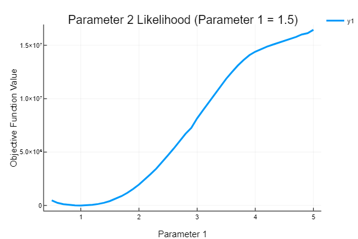

# Parameter Estimation

Parameter estimation for ODE models, also known as dynamic data analysis,
is provided by the DiffEq suite.

## Recommended Methods

The recommended method is to use `build_loss_objective` with the optimizer
of your choice. This method can thus be paired with global optimizers
from packages like BlackBoxOptim.jl or NLopt.jl which can be much less prone to
finding local minima than local optimization methods. Also, it allows the user
to define the cost function in the way they choose as a function
`loss(sol)`, and thus can fit using any cost function on the solution,
making it applicable to fitting non-temporal data and other types of
problems. Also, `build_loss_objective` works for all of the `DEProblem`
types, allowing it to optimize parameters on ODEs, SDEs, DDEs, DAEs,
etc.

However, this method requires repeated solution of the differential equation.
If the data is temporal data, the most efficient method is the
`two_stage_method` which does not require repeated solutions but is not as
accurate. Usage of the `two_stage_method` should have a post-processing step
which refines using a method like `build_loss_objective`.

## Optimization-Based Methods

### two_stage_method

The two-stage method is a collocation method for estimating parameters without
requiring repeated solving of the differential equation. It does so by
determining a smoothed estimated trajectory of the data and optimizing
the derivative function and the data's timepoints to match the derivatives
of the smoothed trajectory. This method has less accuracy than other methods
but is much faster, and is a good method to try first to get in the general
"good parameter" region, to then finish using one of the other methods.

```julia
function two_stage_method(prob::DEProblem,tpoints,data;kernel= :Epanechnikov,
                          loss_func = L2DistLoss,mpg_autodiff = false,
                          verbose = false,verbose_steps = 100)
```

### build_loss_objective

`build_loss_objective` builds an objective function to be used with Optim.jl and MathProgBase-associated solvers like NLopt.

```julia
function build_loss_objective(prob::DEProblem,alg,loss_func
                              regularization=nothing;
                              mpg_autodiff = false,
                              verbose_opt = false,
                              verbose_steps = 100,
                              prob_generator = problem_new_parameters,
                              kwargs...)
```

The first argument is the `DEProblem` to solve, and next is the `alg` to use.
The `alg` must match the problem type, which can be any `DEProblem`
(ODEs, SDEs, DAEs, DDEs, etc.). `regularization` defaults to nothing
which has no regularization function. One can also choose `verbose_opt` and
`verbose_steps`, which, in the optimization routines, will print the steps
and the values at the steps every `verbose_steps` steps. `mpg_autodiff` uses
autodifferentiation to define the derivative for the MathProgBase solver.
The extra keyword arguments are passed to the differential equation solver.

### multiple_shooting_objective

Multiple Shooting is generally used in Boundary Value Problems (BVP) and is more robust than the regular objective function used in these problems. It proceeds as follows:
    
  1. Divide up the time span into short time periods and solve the equation with the current parameters which here consist of both, the parameters of the differential equations and also the initial values for the short time periods.
  2. This objective additionally involves a dicontinuity error term that imposes higher cost if the end of the solution of one time period doesn't match the begining of the next one.
  3. Merge the solutions from the shorter intervals and then calculate the loss.

For consistency `multiple_shooting_objective` takes exactly the same arguments as `build_loss_objective`. It also has the option for `discontinuity_error` as a kwarg which assigns weight to te error occuring due to the discontinuity that arises from the breaking up of the time span.

#### The Loss Function

```julia
loss_func(sol)
```

is a function which reduces the problem's solution to a scalar which the
optimizer will try to minimize. While this is very
flexible, two convenience routines are included for fitting to data with standard
cost functions:

```julia
L2Loss(t,data;weight=nothing)
```

where `t` is the set of timepoints which the data is found at, and
`data` are the values that are known where each column corresponds to measures
of the values of the system. `L2Loss` is an optimized version
of the L2-distance. The `weight` is a vector
of weights for the loss function which must match the size of the data.
Note that minimization of a weighted `L2Loss` is equivalent to maximum
likelihood estimation of a heteroskedastic Normally distributed likelihood.

Additionally, we include a more flexible log-likelihood approach:

```julia
LogLikeLoss(t,distributions;loss_func = L2Loss,weight=nothing)
```

In this case, there are two forms. The simple case is where `distributions[i,j]`
is the likelihood distributions from a `UnivariateDistribution` from
[Distributions.jl](https://juliastats.github.io/Distributions.jl/latest/), where it
corresponds to the likelihood at `t[i]` for component `j`. The second case is
where `distributions[i]` is a `MultivariateDistribution` which corresponds to
the likelihood at `t[i]` over the vector of components. This likelihood function
then calculates the negative of the total loglikelihood over time as its objective
value (negative since optimizers generally find minimimums, and thus this corresponds
to maximum likelihood estimation).

Note that these distributions can be generated via `fit_mle` on some dataset
against some chosen distribution type.

#### Note About Loss Functions

For parameter estimation problems, it's not uncommon for the optimizers to hit
unstable regions of parameter space. This causes warnings that the solver exited
early, and the built-in loss functions like `L2Loss`
automatically handle this. However, if using a user-supplied loss function,
you should make sure it's robust to these issues. One common pattern is to
apply infinite loss when the integration is not successful. Using the retcodes,
this can be done via:

```julia
function my_loss_function(sol)
   tot_loss = 0.0
   if any((s.retcode != :Success for s in sol))
     tot_loss = Inf
   else
     # calculation for the loss here
   end
   tot_loss
end
```
#### First differencing

```julia 
L2Loss(t,data,differ_weight=0.3,data_weight=0.7)
```

First differencing incorporates the differences of data points at consecutive time points which adds more information about the trajectory in the loss function. You can now assign a weight (vector or scalar) to use the first differencing technique in the `L2loss`.

Adding first differencing is helpful in cases where the `L2Loss` alone leads to non-identifiable parameters but adding a first differencing term makes it more identifiable. This can be noted on stochastic differential equation models, where this aims to capture the autocorrelation and therefore helps us avoid getting the same stationary distribution despite different trajectories and thus wrong parameter estimates.

#### The Regularization Function

The regularization can be any function of `p`, the parameter vector:

```julia
regularization(p)
```

The `Regularization` helper function builds a regularization using a
penalty function `penalty` from
[PenaltyFunctions.jl](https://github.com/JuliaML/PenaltyFunctions.jl):

```julia
Regularization(λ,penalty=L2Penalty())
```

The regularization defaults to L2 if no penalty function is specified.
`λ` is the weight parameter for the addition of the regularization term.

#### The Problem Generator Function

The argument `prob_generator` allows one to specify a function for generating
new problems from a given parameter set. By default, this just builds a new
problem which fixes the element types in a way that's autodifferentiation
compatible and adds the new parameter vector `p`. For example, for ODEs this
is given by the dispatch on `DiffEqBase.problem_new_parameters` which does the
following:

```julia
function problem_new_parameters(prob::ODEProblem,p;kwargs...)
  uEltype = eltype(p)
  u0 = [uEltype(prob.u0[i]) for i in 1:length(prob.u0)]
  tspan = (uEltype(prob.tspan[1]),uEltype(prob.tspan[2]))
  ODEProblem{isinplace(prob)}(prob.f,u0,tspan,p,prob.problem_type;
  callback = prob.callback, mass_matrix = prob.mass_matrix,
  kwargs...)
end
```
Then the new problem with these new values is returned.

One can use this to change the meaning of the parameters using this function. For
example, if one instead wanted to optimize the initial conditions for a function
without parameters, you could change this to:

```julia
function my_problem_new_parameters(prob::ODEProblem,p)
  uEltype = eltype(p)
  tspan = (uEltype(prob.tspan[1]),uEltype(prob.tspan[2]))
  ODEProblem(prob.f,p,tspan)
end
```

which simply matches the type for time to `p` (once again, for autodifferentiation)
and uses `p` as the initial condition in the initial value problem.

### build_lsoptim_objective

`build_lsoptim_objective` builds an objective function to be used with LeastSquaresOptim.jl.

```julia
build_lsoptim_objective(prob,tspan,t,data;prob_generator = problem_new_parameters,kwargs...)
```

The arguments are the same as `build_loss_objective`.

### lm_fit

`lm_fit` is a function for fitting the parameters of an ODE using the Levenberg-Marquardt
algorithm. This algorithm is really bad and thus not recommended since, for example,
the Optim.jl algorithms on an L2 loss are more performant and robust. However,
this is provided for completeness as most other differential equation libraries
use an LM-based algorithm, so this allows one to test the increased effectiveness
of not using LM.

```julia
lm_fit(prob::DEProblem,tspan,t,data,p0;prob_generator = problem_new_parameters,kwargs...)
```

The arguments are similar to before, but with `p0` being the initial conditions
for the parameters and the `kwargs` as the args passed to the LsqFit `curve_fit`
function (which is used for the LM solver). This returns the fitted parameters.

### MAP estimate 

You can also add a prior option to `build_loss_objective` and `multiple_shooting_objective` that essentially turns it into MAP by multiplying the loglikelihood (the cost) by the prior. The option was added as a keyword argument `priors`, it can take in either an array of univariate distributions for each of the parameters or a multivariate distribution. 

```julia
ms_obj = multiple_shooting_objective(ms_prob,Tsit5(),L2Loss(t,data);priors=priors,discontinuity_weight=1.0,abstol=1e-12,reltol=1e-12)
```

## Bayesian Methods

The following methods require the DiffEqBayes.jl

```julia
Pkg.add("DiffEqBayes")
using DiffEqBayes
```

### stan_inference

```julia
stan_inference(prob::ODEProblem,t,data,priors = nothing;alg=:rk45,
               num_samples=1000, num_warmup=1000, reltol=1e-3,
               abstol=1e-6, maxiter=Int(1e5),likelihood=Normal,
               vars=(StanODEData(),InverseGamma(2,3)))
```

`stan_inference` uses [Stan.jl](http://goedman.github.io/Stan.jl/latest/INTRO.html)
to perform the Bayesian inference. The
[Stan installation process](http://goedman.github.io/Stan.jl/latest/INSTALLATION.html)
is required to use this function. The input requires that the function is defined
by a `ParameterizedFunction` with the `@ode_def` macro. `t` is the array of time
and `data` is the array where the first dimension (columns) corresponds to the
array of system values. `priors` is an array of prior distributions for each
parameter, specified via a [Distributions.jl](https://juliastats.github.io/Distributions.jl/latest/)
type. `alg` is a choice between `:rk45` and `:bdf`, the two internal integrators
of Stan. `num_samples` is the number of samples to take per chain, and `num_warmup`
is the number of MCMC warmup steps. `abstol` and `reltol` are the keyword
arguments for the internal integrator. `liklihood` is the likelihood distribution
to use with the arguments from `vars`, and `vars` is a tuple of priors for the
distributions of the likelihood hyperparameters. The special value `StanODEData()`
in this tuple denotes the position that the ODE solution takes in the likelihood's
parameter list.

### turing_inference

```julia
turing_inference(prob::DEProblem,alg,t,data,priors = nothing;
                 num_samples=1000, epsilon = 0.02, tau = 4, kwargs...)
```

`turing_inference` uses [Turing.jl](https://github.com/yebai/Turing.jl) to
perform its parameter inference. `prob` can be any `DEProblem` with a corresponding
`alg` choice. `t` is the array of time points and `data[:,i]` is the set of
observations for the differential equation system at time point `t[i]` (or higher
dimensional). `priors` is an array of prior distributions for each
parameter, specified via a
[Distributions.jl](https://juliastats.github.io/Distributions.jl/latest/)
type. `num_samples` is the number of samples per MCMC chain. `epsilon` and `tau`
are the HMC parameters. The extra `kwargs` are given to the internal differential
equation solver.

### dynamichmc_inference

```julia
dynamichmc_inference(prob::DEProblem,alg,t,data,priors,transformations;
                      σ = 0.01,ϵ=0.001,initial=Float64[])
```

`dynamichmc_inference` uses [DynamicHMC.jl](https://github.com/tpapp/DynamicHMC.jl) to 
 perform the bayesian parameter estimation. `prob` can be any `DEProblem`, `data` is the set 
 of observations for our model whihc is to be used in the Bayesian Inference process. `priors` represent the 
 choice of prior distributions for the parameters to be determined, passed as an array of [Distributions.jl]
 (https://juliastats.github.io/Distributions.jl/latest/) distributions. `t` is the array of time points. `transformations`
 is an array of [Tranformations](https://github.com/tpapp/ContinuousTransformations.jl) imposed for constraining the 
 parameter values to specific domains. `initial` values for the parameters can be passed, if not passed the means of the
 `priors` are used. `ϵ` can be used as a kwarg to pass the initial step size for the NUTS algorithm.      
 
### abc_inference

```julia
abc_inference(prob::DEProblem, alg, t, data, priors; ϵ=0.001,
     distancefunction = euclidean, ABCalgorithm = ABCSMC, progress = false,
     num_samples = 500, maxiterations = 10^5, kwargs...)
```

`abc_inference` uses [ApproxBayes.jl](https://github.com/marcjwilliams1/ApproxBayes.jl) which uses Approximate Bayesian Computation (ABC) to
perform its parameter inference. `prob` can be any `DEProblem` with a corresponding
`alg` choice. `t` is the array of time points and `data[:,i]` is the set of
observations for the differential equation system at time point `t[i]` (or higher
dimensional). `priors` is an array of prior distributions for each
parameter, specified via a
[Distributions.jl](https://juliastats.github.io/Distributions.jl/latest/)
type. `num_samples` is the number of posterior samples. `ϵ` is the target
distance between the data and simulated data. `distancefunction` is a distance metric specified from the
[Distances.jl](https://github.com/JuliaStats/Distances.jl)
package, the default is `euclidean`. `ABCalgorithm` is the ABC algorithm to use, options are `ABCSMC` or `ABCRejection` from
[ApproxBayes.jl](https://github.com/marcjwilliams1/ApproxBayes.jl), the default
is the former which is more efficient. `maxiterations` is the maximum number of iterations before the algorithm terminates. The extra `kwargs` are given to the internal differential
equation solver.

## Optimization-Based ODE Inference Examples

### Simple Local Optimization

We choose to optimize the parameters on the Lotka-Volterra equation. We do so
by defining the function as a [ParameterizedFunction](https://github.com/JuliaDiffEq/ParameterizedFunctions.jl):

```julia
f = @ode_def LotkaVolterraTest begin
  dx = a*x - x*y
  dy = -3y + x*y
end a

u0 = [1.0;1.0]
tspan = (0.0,10.0)
p = [1.5]
prob = ODEProblem(f,u0,tspan,p)
```

We create data using the numerical result with `a=1.5`:

```julia
sol = solve(prob,Tsit5())
t = collect(linspace(0,10,200))
using RecursiveArrayTools # for VectorOfArray
randomized = VectorOfArray([(sol(t[i]) + .01randn(2)) for i in 1:length(t)])
data = convert(Array,randomized)
```

Here we used `VectorOfArray` from [RecursiveArrayTools.jl](https://github.com/ChrisRackauckas/RecursiveArrayTools.jl)
to turn the result of an ODE into a matrix.

If we plot the solution with the parameter at `a=1.42`, we get the following:


Notice that after one period this solution begins to drift very far off: this
problem is sensitive to the choice of `a`.

To build the objective function for Optim.jl, we simply call the `build_loss_objective`
function:

```julia
cost_function = build_loss_objective(prob,Tsit5(),L2Loss(t,data),
                                     maxiters=10000,verbose=false)
```

This objective function internally is calling the ODE solver to get solutions
to test against the data. The keyword arguments are passed directly to the solver.
Note that we set `maxiters` in a way that causes the differential equation solvers to
error more quickly when in bad regions of the parameter space, speeding up the
process. If the integrator stops early (due to divergence), then those parameters
are given an infinite loss, and thus this is a quick way to avoid bad parameters.
We set `verbose=false` because this divergence can get noisy.

Before optimizing, let's visualize our cost function by plotting it for a range
of parameter values:

```julia
range = 0.0:0.1:10.0
using Plots; plotly()
plot(range,[cost_function(i) for i in range],yscale=:log10,
     xaxis = "Parameter", yaxis = "Cost", title = "1-Parameter Cost Function",
     lw = 3)
```


Here we see that there is a very well-defined minimum in our cost function at
the real parameter (because this is where the solution almost exactly fits the
dataset).

Now this cost function can be used with Optim.jl in order to get the parameters.
For example, we can use Brent's algorithm to search for the best solution on
the interval `[0,10]` by:

```julia
using Optim
result = optimize(cost_function, 0.0, 10.0)
```

This returns `result.minimizer[1]==1.5` as the best parameter to match the data.
When we plot the fitted equation on the data, we receive the following:


Thus we see that after fitting, the lines match up with the generated data and
receive the right parameter value.

We can also use the multivariate optimization functions. For example, we can use
the `BFGS` algorithm to optimize the parameter starting at `a=1.42` using:

```julia
result = optimize(cost_function, [1.42], BFGS())
```

Note that some of the algorithms may be sensitive to the initial condition. For more
details on using Optim.jl, see the [documentation for Optim.jl](http://julianlsolvers.github.io/Optim.jl/latest/).
We can improve our solution by noting that the Lotka-Volterra equation requires that
the parameters are positive. Thus [following the Optim.jl documentation](http://julianlsolvers.github.io/Optim.jl/latest/user/minimization/#box-minimization)
we can add box constraints to ensure the optimizer only checks between 0.0 and 3.0
which improves the efficiency of our algorithm:

```julia
lower = [0.0]
upper = [3.0]
result = optimize(cost_function, [1.42], lower, upper, Fminbox{BFGS}())
```

Lastly, we can use the same tools to estimate multiple parameters simultaneously.
Let's use the Lotka-Volterra equation with all parameters free:

```julia
f2 = @ode_def_nohes LotkaVolterraAll begin
  dx = a*x - b*x*y
  dy = -c*y + d*x*y
end a b c d

u0 = [1.0;1.0]
tspan = (0.0,10.0)
p = [1.5,1.0,3.0,1.0]
prob = ODEProblem(f2,u0,tspan,p)
```

We can build an objective function and solve the multiple parameter version just as before:

```julia
cost_function = build_loss_objective(prob,Tsit5(),L2Loss(t,data),
                                      maxiters=10000,verbose=false)
result_bfgs = Optim.optimize(cost_function, [1.3,0.8,2.8,1.2], Optim.BFGS())
```

To solve it using LeastSquaresOptim.jl, we use the `build_lsoptim_objective` function:

```julia
cost_function = build_lsoptim_objective(prob1,t,data,Tsit5())
```

The result is a cost function which can be used with LeastSquaresOptim. For more
details, consult the [documentation for LeastSquaresOptim.jl](https://github.com/matthieugomez/LeastSquaresOptim.jl):

```julia
x = [1.3,0.8,2.8,1.2]
res = optimize!(LeastSquaresProblem(x = x, f! = cost_function,
                output_length = length(t)*length(prob.u0)),
                LeastSquaresOptim.Dogleg(),LeastSquaresOptim.LSMR())
```

We can see the results are:

```julia
println(res.minimizer)

Results of Optimization Algorithm
 * Algorithm: Dogleg
 * Minimizer: [1.4995074428834114,0.9996531871795851,3.001556360700904,1.0006272074128821]
 * Sum of squares at Minimum: 0.035730
 * Iterations: 63
 * Convergence: true
 * |x - x'| < 1.0e-15: true
 * |f(x) - f(x')| / |f(x)| < 1.0e-14: false
 * |g(x)| < 1.0e-14: false
 * Function Calls: 64
 * Gradient Calls: 9
 * Multiplication Calls: 135
```

and thus this algorithm was able to correctly identify all four parameters.

We can also use Multiple Shooting method by creating a `multiple_shooting_objective`

```julia
ms_f = @ode_def_nohes LotkaVolterraTest begin
    dx = a*x - b*x*y
    dy = -3*y + x*y
end a b 
ms_u0 = [1.0;1.0]
tspan = (0.0,10.0)
ms_p = [1.5,1.0]
ms_prob = ODEProblem(ms_f,ms_u0,tspan,ms_p)
t = collect(linspace(0,10,200))
data = Array(solve(ms_prob,Tsit5(),saveat=t,abstol=1e-12,reltol=1e-12))
bound = Tuple{Float64, Float64}[(0, 10),(0, 10),(0, 10),(0, 10),
                                (0, 10),(0, 10),(0, 10),(0, 10),
                                (0, 10),(0, 10),(0, 10),(0, 10),
                                (0, 10),(0, 10),(0, 10),(0, 10),(0, 10),(0, 10)]


ms_obj = multiple_shooting_objective(ms_prob,Tsit5(),L2Loss(t,data);discontinuity_weight=1.0,abstol=1e-12,reltol=1e-12)
```

This creates the objective function that can be passed to an optimizer from which we can then get the parameter values and the initial values of the short time periods keeping in mind the indexing.

```julia
result = bboptimize(ms_obj;SearchRange = bound, MaxSteps = 21e3)
result.archive_output.best_candidate[end-1:end]
```
Giving us the results as
```julia
Starting optimization with optimizer BlackBoxOptim.DiffEvoOpt{BlackBoxOptim.FitPopulation{Float64},BlackBoxOptim.RadiusLimitedSelector,BlackBoxOptim.AdaptiveDiffEvoRandBin{3},BlackBoxOptim.RandomBound{BlackBoxOptim.RangePerDimSearchSpace}}

Optimization stopped after 21001 steps and 136.60030698776245 seconds
Termination reason: Max number of steps (21000) reached
Steps per second = 153.7405036862868
Function evals per second = 154.43596332393247
Improvements/step = 0.17552380952380953
Total function evaluations = 21096


Best candidate found: [0.997396, 1.04664, 3.77834, 0.275823, 2.14966, 4.33106, 1.43777, 0.468442, 6.22221, 0.673358, 0.970036, 2.05182, 2.4216, 0.274394, 5.64131, 3.38132, 1.52826, 1.01721]

Fitness: 0.126884213

Out[4]:2-element Array{Float64,1}:
        1.52826
        1.01721
```
Here as our model had 2 parameters, we look at the last two indexes of `result` to get our parameter values and the rest of the values are the initial values of the shorter timespans as described in the reference section.

### More Algorithms (Global Optimization) via MathProgBase Solvers

The `build_loss_objective` function builds an objective function which is able
to be used with MathProgBase-associated solvers. This includes packages like
IPOPT, NLopt, MOSEK, etc. Building off of the previous example, we can build a
cost function for the single parameter optimization problem like:

```julia
f = @ode_def_nohes LotkaVolterraTest begin
  dx = a*x - x*y
  dy = -3y + x*y
end a

u0 = [1.0;1.0]
tspan = (0.0,10.0)
p = [1.5]
prob = ODEProblem(f,u0,tspan,p)
sol = solve(prob,Tsit5())

t = collect(linspace(0,10,200))
randomized = VectorOfArray([(sol(t[i]) + .01randn(2)) for i in 1:length(t)])
data = convert(Array,randomized)

obj = build_loss_objective(prob,Tsit5(),L2Loss(t,data),maxiters=10000)
```

We can now use this `obj` as the objective function with MathProgBase solvers.
For our example, we will use NLopt. To use the local derivative-free
Constrained Optimization BY Linear Approximations algorithm, we can simply do:

```julia
using NLopt
opt = Opt(:LN_COBYLA, 1)
min_objective!(opt, obj)
(minf,minx,ret) = NLopt.optimize(opt,[1.3])
```

This finds a minimum at `[1.49997]`. For a modified evolutionary algorithm, we
can use:

```julia
opt = Opt(:GN_ESCH, 1)
min_objective!(opt, obj)
lower_bounds!(opt,[0.0])
upper_bounds!(opt,[5.0])
xtol_rel!(opt,1e-3)
maxeval!(opt, 100000)
(minf,minx,ret) = NLopt.optimize(opt,[1.3])
```

We can even use things like the Improved Stochastic Ranking Evolution Strategy
(and add constraints if needed). This is done via:

```julia
opt = Opt(:GN_ISRES, 1)
min_objective!(opt, obj.cost_function2)
lower_bounds!(opt,[-1.0])
upper_bounds!(opt,[5.0])
xtol_rel!(opt,1e-3)
maxeval!(opt, 100000)
(minf,minx,ret) = NLopt.optimize(opt,[0.2])
```

which is very robust to the initial condition. The fastest result comes from the
following:

```julia
using NLopt
opt = Opt(:LN_BOBYQA, 1)
min_objective!(opt, obj)
(minf,minx,ret) = NLopt.optimize(opt,[1.3])
```

For more information, see the NLopt documentation for more details. And give IPOPT
or MOSEK a try!

### Generalized Likelihood Example

In this example we will demo the likelihood-based approach to parameter fitting.
First let's generate a dataset to fit. We will re-use the Lotka-Volterra equation
but in this case fit just two parameters. Note that the parameter estimation
tools do not require the use of the `@ode_def` macro, so let's demonstrate
what the macro-less version looks like:

```julia
f1 = function (du,u,p,t)
  du[1] = p[1] * u[1] - p[2] * u[1]*u[2]
  du[2] = -3.0 * u[2] + u[1]*u[2]
end
p = [1.5,1.0]
u0 = [1.0;1.0]
tspan = (0.0,10.0)
prob1 = ODEProblem(f1,u0,tspan,p)
sol = solve(prob1,Tsit5())
```

This is a function with two parameters, `[1.5,1.0]` which generates the same
ODE solution as before. This time, let's generate 100 datasets where at each point
adds a little bit of randomness:

```julia
using RecursiveArrayTools # for VectorOfArray
t = collect(linspace(0,10,200))
function generate_data(sol,t)
  randomized = VectorOfArray([(sol(t[i]) + .01randn(2)) for i in 1:length(t)])
  data = convert(Array,randomized)
end
aggregate_data = convert(Array,VectorOfArray([generate_data(sol,t) for i in 1:100]))
```

here with `t` we measure the solution at 200 evenly spaced points. Thus `aggregate_data`
is a 2x200x100 matrix where `aggregate_data[i,j,k]` is the `i`th component at time
`j` of the `k`th dataset. What we first want to do is get a matrix of distributions
where `distributions[i,j]` is the likelihood of component `i` at take `j`. We
can do this via `fit_mle` on a chosen distributional form. For simplicity we
choose the `Normal` distribution. `aggregate_data[i,j,:]` is the array of points
at the given component and time, and thus we find the distribution parameters
which fits best at each time point via:

```julia
using Distributions
distributions = [fit_mle(Normal,aggregate_data[i,j,:]) for i in 1:2, j in 1:200]
```

Notice for example that we have:

```julia
julia> distributions[1,1]
Distributions.Normal{Float64}(μ=1.0022440583676806, σ=0.009851964521952437)
```

that is, it fit the distribution to have its mean just about where our original
solution was and the variance is about how much noise we added to the dataset.
This this is a good check to see that the distributions we are trying to fit
our parameters to makes sense.

Note that in this case the `Normal` distribution was a good choice, and in many
cases it's a nice go-to choice, but one should experiment with other choices
of distributions as well. For example, a `TDist` can be an interesting way to
incorporate robustness to outliers since low degrees of free T-distributions
act like Normal distributions but with longer tails (though `fit_mle` does not
work with a T-distribution, you can get the means/variances and build appropriate
distribution objects yourself).

Once we have the matrix of distributions, we can build the objective function
corresponding to that distribution fit:

```julia
using DiffEqParamEstim
obj = build_loss_objective(prob1,Tsit5(),LogLikeLoss(t,distributions),
                                     maxiters=10000,verbose=false)
```

First let's use the objective function to plot the likelihood landscape:

```julia
using Plots; plotly()
range = 0.5:0.1:5.0
heatmap(range,range,[obj([j,i]) for i in range, j in range],
        yscale=:log10,xlabel="Parameter 1",ylabel="Parameter 2",
        title="Likelihood Landscape")
```


Recall that this is the negative loglikelihood and thus the minimum is the
maximum of the likelihood. There is a clear valley where the second parameter
is 1.5, while the first parameter's likelihood is more muddled. By taking a
one-dimensional slice:

```julia
plot(range,[obj([i,1.0]) for i in range],lw=3,
     title="Parameter 1 Likelihood (Parameter 2 = 1.5)",
     xlabel = "Parameter 1", ylabel = "Objective Function Value")
```



we can see that there's still a clear minimum at the true value. Thus we will
use the global optimizers from BlackBoxOptim.jl to find the values. We set our
search range to be from `0.5` to `5.0` for both of the parameters and let it
optimize:

```julia
using BlackBoxOptim
bound1 = Tuple{Float64, Float64}[(0.5, 5),(0.5, 5)]
result = bboptimize(obj;SearchRange = bound1, MaxSteps = 11e3)

Starting optimization with optimizer BlackBoxOptim.DiffEvoOpt{BlackBoxOptim.FitPopulation{Float64},B
lackBoxOptim.RadiusLimitedSelector,BlackBoxOptim.AdaptiveDiffEvoRandBin{3},BlackBoxOptim.RandomBound
{BlackBoxOptim.RangePerDimSearchSpace}}
0.00 secs, 0 evals, 0 steps
0.50 secs, 1972 evals, 1865 steps, improv/step: 0.266 (last = 0.2665), fitness=-737.311433781
1.00 secs, 3859 evals, 3753 steps, improv/step: 0.279 (last = 0.2913), fitness=-739.658421879
1.50 secs, 5904 evals, 5799 steps, improv/step: 0.280 (last = 0.2830), fitness=-739.658433715
2.00 secs, 7916 evals, 7811 steps, improv/step: 0.225 (last = 0.0646), fitness=-739.658433715
2.50 secs, 9966 evals, 9861 steps, improv/step: 0.183 (last = 0.0220), fitness=-739.658433715

Optimization stopped after 11001 steps and 2.7839999198913574 seconds
Termination reason: Max number of steps (11000) reached
Steps per second = 3951.50873439296
Function evals per second = 3989.2242527195904
Improvements/step = 0.165
Total function evaluations = 11106


Best candidate found: [1.50001, 1.00001]

Fitness: -739.658433715
```

This shows that it found the true parameters as the best fit to the likelihood.

## Parameter Estimation for Stochastic Differential Equations and Monte Carlo

We can use any `DEProblem`, which not only includes `DAEProblem` and `DDEProblem`s,
but also stochastic problems. In this case, let's use the generalized maximum
likelihood to fit the parameters of an SDE's Monte Carlo evaluation.

Let's use the same Lotka-Volterra equation as before, but this time add noise:

```julia
pf = function (du,u,p,t)
  du[1] = p[1] * u[1] - u[1]*u[2]
  du[2] = -3u[2] + u[1]*u[2]
end

u0 = [1.0;1.0]
pg = function (du,u,p,t)
  du[1] = p[2]*u[1]
  du[2] = 1e-2u[2]
end
p = [1.5,1e-2]
tspan = (0.0,10.0)
prob = SDEProblem(pf,pg,u0,tspan,p)
```

Now lets generate a dataset from 10,000 solutions of the SDE

```julia
using RecursiveArrayTools # for VectorOfArray
t = collect(linspace(0,10,200))
function generate_data(t)
  sol = solve(prob,SRIW1())
  randomized = VectorOfArray([(sol(t[i]) + .01randn(2)) for i in 1:length(t)])
  data = convert(Array,randomized)
end
aggregate_data = convert(Array,VectorOfArray([generate_data(t) for i in 1:10000]))
```

Instead of using `UnivariateDistribution`s like in the previous example, lets fit
our data to `MultivariateNormal` distributions.

```julia
using Distributions
distributions = [fit_mle(MultivariateNormal,aggregate_data[:,j,:]) for j in 1:200]
```

Now let's estimate the parameters. Instead of using single runs from the SDE, we
will use a `MonteCarloProblem`. This means that it will solve the SDE `N` times
to come up with an approximate probability distribution at each time point and
use that in the likelihood estimate.

```julia
monte_prob = MonteCarloProblem(prob)
obj = build_loss_objective(monte_prob,SOSRI(),LogLikeLoss(t,distributions),
                                     maxiters=10000,verbose=false,num_monte = 1000,
                                     parallel_type = :threads)
```

To speed things up I enabled multithreading. Just as before, we hand this over
to BlackBoxOptim.jl:

```julia
using BlackBoxOptim
bound1 = Tuple{Float64, Float64}[(0.5, 3),(1e-3, 1e-1)]
result = bboptimize(obj;SearchRange = bound1, MaxSteps = 400)

Optimization stopped after 201 steps and 2713
.5920000076294 seconds
Termination reason: Max number of steps (200)
 reached
Steps per second = 0.07407156271076672
Function evals per second = 0.106869418836429
59
Improvements/step = 0.42
Total function evaluations = 290


Best candidate found: [1.52075, 0.0216393]

Fitness: 1544423.794270536
```


Here we see that we successfully recovered the drift parameter, and got close to
the original noise parameter after searching a two orders of magnitude range.
It would require a larger `num_monte` to accurately get samples of the the
variance and receive a better estimate there.

## Bayesian Inference Examples

### Stan

Like in the previous examples, we setup the Lotka-Volterra system and generate
data:

```julia
f1 = @ode_def LotkaVolterraTest4 begin
  dx = a*x - b*x*y
  dy = -c*y + d*x*y
end a b c d
p = [1.5,1.0,3.0,1.0]
u0 = [1.0,1.0]
tspan = (0.0,10.0)
prob1 = ODEProblem(f1,u0,tspan,p)
sol = solve(prob1,Tsit5())
t = collect(linspace(1,10,10))
randomized = VectorOfArray([(sol(t[i]) + .01randn(2)) for i in 1:length(t)])
data = convert(Array,randomized)
```

Here we now give Stan an array of prior distributions for our parameters. Since
the parameters of our differential equation must be positive, we utilize
truncated Normal distributions to make sure that is satisfied in the result:

```julia
priors = [Truncated(Normal(1.5,0.1),0,2),Truncated(Normal(1.0,0.1),0,1.5),
          Truncated(Normal(3.0,0.1),0,4),Truncated(Normal(1.0,0.1),0,2)]
```

We then give these to the inference function.

```julia
bayesian_result = stan_inference(prob1,t,data,priors;
                                 num_samples=100,num_warmup=500,
                                 vars = (StanODEData(),InverseGamma(4,1)))
```

`InverseGamma(4,1)` is our starting estimation for the variance hyperparameter
of the default `Normal` distribution. The result is a
[Mamba.jl](http://mambajl.readthedocs.io/en/latest/intro.html) chain object.
We can pull out the parameter values via:

```julia
theta1 = bayesian_result.chain_results[:,["theta.1"],:]
theta2 = bayesian_result.chain_results[:,["theta.2"],:]
theta3 = bayesian_result.chain_results[:,["theta.3"],:]
theta4 = bayesian_result.chain_results[:,["theta.4"],:]
```

From these chains we can get our estimate for the parameters via:

```julia
mean(theta1.value[:,:,1])
```

We can get more of a description via:

```julia
Mamba.describe(bayesian_result.chain_results)

# Result

Iterations = 1:100
Thinning interval = 1
Chains = 1,2,3,4
Samples per chain = 100

Empirical Posterior Estimates:
                  Mean         SD        Naive SE        MCSE         ESS    
         lp__ -6.15472697 1.657551334 0.08287756670 0.18425029767  80.9314979
accept_stat__  0.90165904 0.125913744 0.00629568721 0.02781181930  20.4968668
   stepsize__  0.68014975 0.112183047 0.00560915237 0.06468790087   3.0075188
  treedepth__  2.68750000 0.524911975 0.02624559875 0.10711170182  24.0159141
 n_leapfrog__  6.77000000 4.121841086 0.20609205428 0.18645821695 100.0000000
  divergent__  0.00000000 0.000000000 0.00000000000 0.00000000000         NaN
     energy__  9.12245750 2.518330231 0.12591651153 0.32894488320  58.6109941
     sigma1.1  0.57164997 0.128579363 0.00642896816 0.00444242658 100.0000000
     sigma1.2  0.58981422 0.131346442 0.00656732209 0.00397310122 100.0000000
       theta1  1.50237077 0.008234095 0.00041170473 0.00025803930 100.0000000
       theta2  0.99778276 0.009752574 0.00048762870 0.00009717115 100.0000000
       theta3  3.00087782 0.009619775 0.00048098873 0.00020301023 100.0000000
       theta4  0.99803569 0.008893244 0.00044466218 0.00040886528 100.0000000
      theta.1  1.50237077 0.008234095 0.00041170473 0.00025803930 100.0000000
      theta.2  0.99778276 0.009752574 0.00048762870 0.00009717115 100.0000000
      theta.3  3.00087782 0.009619775 0.00048098873 0.00020301023 100.0000000
      theta.4  0.99803569 0.008893244 0.00044466218 0.00040886528 100.0000000

Quantiles:
                  2.5%        25.0%      50.0%      75.0%       97.5%   
         lp__ -10.11994750 -7.0569000 -5.8086150 -4.96936500 -3.81514375
accept_stat__   0.54808912  0.8624483  0.9472840  0.98695850  1.00000000
   stepsize__   0.57975100  0.5813920  0.6440120  0.74276975  0.85282400
  treedepth__   2.00000000  2.0000000  3.0000000  3.00000000  3.00000000
 n_leapfrog__   3.00000000  7.0000000  7.0000000  7.00000000 15.00000000
  divergent__   0.00000000  0.0000000  0.0000000  0.00000000  0.00000000
     energy__   5.54070300  7.2602200  8.7707000 10.74517500 14.91849500
     sigma1.1   0.38135240  0.4740865  0.5533195  0.64092575  0.89713635
     sigma1.2   0.39674703  0.4982615  0.5613655  0.66973025  0.88361407
       theta1   1.48728600  1.4967650  1.5022750  1.50805500  1.51931475
       theta2   0.97685115  0.9914630  0.9971435  1.00394250  1.01765575
       theta3   2.98354100  2.9937575  3.0001450  3.00819000  3.02065950
       theta4   0.97934128  0.9918495  0.9977415  1.00430750  1.01442975
      theta.1   1.48728600  1.4967650  1.5022750  1.50805500  1.51931475
      theta.2   0.97685115  0.9914630  0.9971435  1.00394250  1.01765575
      theta.3   2.98354100  2.9937575  3.0001450  3.00819000  3.02065950
      theta.4   0.97934128  0.9918495  0.9977415  1.00430750  1.01442975
```

More extensive information about the distributions is given by the plots:

```julia
plot_chain(bayesian_result)
```

### Turing

This case we will build off of the Stan example. Note that `turing_inference`
does not require the use of the `@ode_def` macro like Stan does, but it will
still work with macro-defined functions. Thus, using the same setup as before,
we simply give the setup to:

```julia
bayesian_result = turing_inference(prob,Tsit5(),t,data,priors;num_samples=500)
```

The chain for the `i`th parameter is then given by:

```julia
bayesian_result[:theta1]
```

Summary statistics can be also be accessed:
```julia
Mamba.describe(bayesian_result)
```

The chain can be analysed by the trace plots and other plots obtained by:

```julia
plot_chain(bayesian_result)
```

### DynamicHMC

We can use [DynamicHMC.jl](https://github.com/tpapp/DynamicHMC.jl) as the backend
for sampling with the `dynamic_inference` function. It supports any `DEProblem`, 
`priors` can be passed as an array of [Distributions.jl](https://juliastats.github.io/Distributions.jl/latest/)
distributions, passing `initial` values is optional and in case where the user has a firm understanding of the 
domain the parameter values will lie in, `tranformations` can be used to pass an array of constraints for the parameters
as an array of [Transformations](https://github.com/tpapp/ContinuousTransformations.jl).

```julia
bayesian_result_hmc = dynamichmc_inference(prob1, Tsit5(), t, data, [Normal(1.5, 1)], [bridge(ℝ, ℝ⁺, )])
```

A tuple with summary statistics and the chain values is returned.
The chain for the `i`th parameter is given by:

```julia
bayesian_result_hmc[1][i]
```
For accessing the various summary statistics:

```julia
DynamicHMC.NUTS_statistics(bayesian_result_dynamic[2])
```
Some details about the NUTS sampler can be obtained from:

```julia
bayesian_result_dynamic[3]
```

In case of `dynamic_inference` the trace plots for the `i`th parameter can be obtained by:

```julia
plot(bayesian_result_hmc[1][i])
```

For a better idea of the summary statistics and plotting you can take a look at the benchmark
[notebooks](https://github.com/JuliaDiffEq/DiffEqBenchmarks.jl/tree/master/ParameterEstimation)
