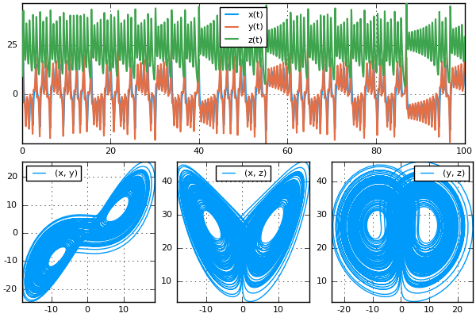
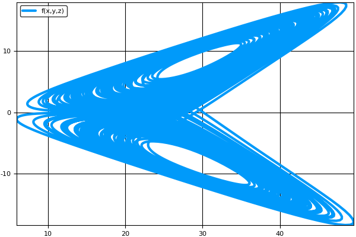

# [Plot Functions](@id plot)

## Standard Plots Using the Plot Recipe

Plotting functionality is provided by recipes to Plots.jl. To
plot solutions, simply call the `plot(type)` after importing Plots.jl
and the plotter will generate appropriate plots.

```julia
#]add Plots # You need to install Plots.jl before your first time using it!
using Plots
plot(sol) # Plots the solution
```

Many of the types defined in the DiffEq universe, such as
`ODESolution`, `ConvergenceSimulation` `WorkPrecision`, etc. have plot recipes
to handle the default plotting behavior. Plots can be customized using
[all of the keyword arguments provided by Plots.jl](http://docs.juliaplots.org/dev/supported/).
For example, we can change the plotting backend to the GR package and put a title
on the plot by doing:

```julia
gr()
plot(sol,title="I Love DiffEqs!")
```

Then to save the plot, use `savefig`, for example:

```julia
savefig("myplot.png")
```

## Density

If the problem was solved with `dense=true`, then `denseplot` controls whether
to use the dense function for generating the plot, and `plotdensity` is the number
of evenly-spaced points (in time) to plot. For example:

```julia
plot(sol,denseplot=false)
```

means "only plot the points which the solver stepped to", while:

```julia
plot(sol,plotdensity=1000)
```

means to plot 1000 points using the dense function (since `denseplot=true` by
default).

## [Choosing Variables](@id plot_vars)

In the plot command, one can choose the variables to be plotted in each plot. The
master form is:

```julia
vars = [(f1,0,1), (f2,1,3), (f3,4,5)]
```

which could be used to plot `f1(var₀, var₁)`, `f2(var₁, var₃)`, and
`f3(var₄, var₅)`, all on the same graph. (`0` is considered to be *time*,
or the independent variable). Functions `f1`, `f2` and `f3` should take in scalars
and return a tuple. If no function is given, for example,

```julia
vars = [(0,1), (1,3), (4,5)]
```

this would mean "plot `var₁(t)` vs `t` (*time*), `var₃(var₁)` vs `var₁`, and
`var₅(var₄)` vs `var₄` all on the same graph, putting the independent variables
(`t`, `var₁` and `var₄`) on the x-axis." While this can be used for everything,
the following conveniences are provided:

* Everywhere in a tuple position where we only find an integer, this
  variable is plotted as a function of time.  For example, the list above
  is equivalent to:

```julia
vars = [1, (1,3), (4,5)]
```

and

```julia
vars = [1, 3, 4]
```

is the most concise way to plot the variables 1, 3, and 4 as a function
of time.

* It is possible to omit the list if only one plot is wanted: `(2,3)`
  and `4` are respectively equivalent to `[(2,3)]` and `[(0,4)]`.

* A tuple containing one or several lists will be expanded by
  associating corresponding elements of the lists with each other:

```julia
vars = ([1,2,3], [4,5,6])
```

is equivalent to

```julia
vars = [(1,4), (2,5), (3,6)]
```

and

```julia
vars = (1, [2,3,4])
```

is equivalent to

```julia
vars = [(1,2), (1,3), (1,4)]
```

* Instead of using integers, one can use the symbols from a `ParameterizedFunction`.
  For example, `vars=(:x,:y)` will replace the symbols with the integer values for
  components `:x` and `:y`.

* n-dimensional groupings are allowed. For example, `(1,2,3,4,5)` would be a
  5-dimensional plot between the associated variables.

### Complex Numbers and High Dimensional Plots

The recipe library DimensionalPlotRecipes.jl is provided for extra functionality
on high dimensional numbers (complex numbers) and other high dimensional plots.
See [the README](https://github.com/JuliaDiffEq/DimensionalPlotRecipes.jl) for
more details on the extra controls that exist.

### Timespan

A plotting timespan can be chosen by the `tspan` argument in `plot`. For example:

```julia
plot(sol,tspan=(0.0,40.0))
```

only plots between `t=0.0` and `t=40.0`. If `denseplot=true` these bounds will be respected
exactly. Otherwise the first point inside and last point inside the interval will be plotted,
i.e. no points outside the interval will be plotted.

### Example

```julia
using DifferentialEquations, Plots
function lorenz(du,u,p,t)
 du[1] = p[1]*(u[2]-u[1])
 du[2] = u[1]*(p[2]-u[3]) - u[2]
 du[3] = u[1]*u[2] - p[3]*u[3]
end

u0 = [1., 5., 10.]
tspan = (0., 100.)
p = (10.0,28.0,8/3)
prob = ODEProblem(lorenz, u0, tspan,p)
sol = solve(prob)
xyzt = plot(sol, plotdensity=10000,lw=1.5)
xy = plot(sol, plotdensity=10000, vars=(1,2))
xz = plot(sol, plotdensity=10000, vars=(1,3))
yz = plot(sol, plotdensity=10000, vars=(2,3))
xyz = plot(sol, plotdensity=10000, vars=(1,2,3))
plot(plot(xyzt,xyz),plot(xy, xz, yz, layout=(1,3),w=1), layout=(2,1))
```



An example using the functions:

```julia
f(x,y,z) = (sqrt(x^2+y^2+z^2),x)
plot(sol,vars=(f,1,2,3))
```



or the norm over time:

```julia
f(t,x,y,z) = (t,sqrt(x^2+y^2+z^2))
plot(sol,vars=(f,0,1,2,3))
```


## Animations

Using the iterator interface over the solutions, animations can also be generated
via the `animate(sol)` command. One can choose the `filename` to save to via
`animate(sol,filename)`, while the frames per second `fps` and the density of steps
to show `every` can be specified via keyword arguments.
The rest of the arguments will be directly passed to the plot recipe to be handled
as normal. For example, we can animate our solution with a larger line-width which
saves every 4th frame via:

```julia
#]add ImageMagick # You may need to install ImageMagick.jl before your first time using it!
#using ImageMagick # Some installations require using ImageMagick for good animations
animate(sol,lw=3,every=4)
```

Please see [Plots.jl's documentation](https://juliaplots.github.io/) for more information
on the available attributes.

## Plotting Without the Plot Recipe

What if you don't want to use Plots.jl? Odd choice, but that's okay! If the differential
equation was described by a vector of values, then the solution object acts as
an `AbstractMatrix` `sol[i,j]` for the `i`th variable at timepoint `j`. You can
use this to plot solutions. For example, in PyPlot, Gadfly, GR, etc., you can
do the following to plot the timeseries:

```julia
plot(sol.t,sol')
```

since these plot along the columns, and `sol'` has the timeseries along the column.
Phase plots can be done similarly, for example:

```julia
plot(sol[i,:],sol[j,:],sol[k,:])
```

is a 3d phase plot between variables `i`, `j`, and `k`.

Notice that this does not use the interpolation. When not using the plot recipe,
the interpolation must be done manually. For example:

```julia
n = 101 #number of timepoints
ts = range(0, stop=1, length=n)
plot(sol(ts,idxs=i),sol(ts,idxs=j),sol(ts,idxs=k))
```

is the phase space using values `0.01` apart in time.
