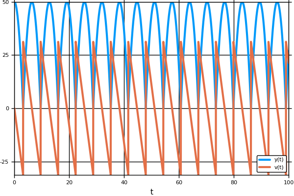

# Event Handling and Callback Functions

## Introduction to Callback Functions

DifferentialEquations.jl allows for using callback functions to inject user code
into the solver algorithms. It allows for safely and accurately applying events
and discontinuities. Multiple callbacks can be chained together, and these callback
types can be used to build libraries of extension behavior.

## The Callback Types

The callback types are defined as follows. There are two callback types: the
`ContinuousCallback` and the `DiscreteCallback`. The `ContinuousCallback` is
applied when a continuous condition function hits zero. This type of callback
implements what is known in other problem solving environments as an Event. A
`DiscreteCallback` is applied when its `condition` function is `true`.

### ContinuousCallbacks

```julia
ContinuousCallback(condition,affect!;
                   rootfind = true,
                   save_positions = (true,true),
                   interp_points=10,
                   abstol=1e-12,reltol=0
                   idxs=nothing)

ContinuousCallback(condition,affect!,affect_neg!;
                  rootfind = true,
                  save_positions = (true,true),
                  interp_points=10,
                  abstol=1e-12,reltol=0,
                  idxs=nothing)
```

The arguments are defined as follows:

* `condition`: This is a function `condition(t,u,integrator)` for declaring when
  the callback should be used. A callback is initiated if the condition hits
  `0` within the time interval.
* `affect!`: This is the function `affect!(integrator)` where one is allowed to
  modify the current state of the integrator. This is called when `condition` is
  found to be `0` (at a root) and the cross is an upcrossing (from negative to
  positive). For more information on what can
  be done, see the [Integrator Interface](@ref) manual page. Modifications to
  `u` are safe in this function.
* `rootfind`: This is a boolean for whether to rootfind the event location. If
  this is set to `true`, the solution will be backtracked to the point where
  `condition==0`. Otherwise the systems and the `affect!` will occur at `t+dt`.
* `interp_points`: The number of interpolated points to check the condition. The
  condition is found by checking whether any interpolation point / endpoint has
  a different sign. If `interp_points=0`, then conditions will only be noticed if
  the sign of `condition` is different at `t` than at `t+dt`. This behavior is not
  robust when the solution is oscillatory, and thus it's recommended that one use
  some interpolation points (they're cheap to compute!).
  `0` within the time interval.
* `affect_neg!`: This is the function `affect_neg!(integrator)` where one is allowed to
  modify the current state of the integrator. This is called when `condition` is
  found to be `0` (at a root) and the cross is an downcrossing (from positive to
  negative). For more information on what can
  be done, see the [Integrator Interface](@ref) manual page. Modifications to
  `u` are safe in this function.
* `save_positions`: Boolean tuple for whether to save before and after the `affect!`.
  The first save will always occcur (if true), and the second will only occur when
  an event is detected.  For discontinuous changes like a modification to `u` to be
  handled correctly (without error), one should set `save_positions=(true,true)`.
* `idxs`: The components which will be interpolated into the condition. Defaults
  to `nothing` which means `u` will be all components.

Additionally, keyword arguments for `abstol` and `reltol` can be used to specify
a tolerance from zero for the rootfinder: if the starting condition is less than
the tolerance from zero, then no root will be detected. This is to stop repeat
events happening just after a previously rootfound event. The default has
`abstol=1e-14` and `reltol=0`.

### DiscreteCallback

```julia
DiscreteCallback(condition,affect!,save_positions)
```

* `condition`: This is a function `condition(t,u,integrator)` for declaring when
  the callback should be used. A callback is initiated if the condition evaluates
  to `true`.
* `affect!`: This is the function `affect!(integrator)` where one is allowed to
  modify the current state of the integrator. For more information on what can
  be done, see the [Integrator Interface](@ref) manual page.
* `save_positions`: Boolean tuple for whether to save before and after the `affect!`.
  The first save will always occcur (if true), and the second will only occur when
  an event is detected.  For discontinuous changes like a modification to `u` to be
  handled correctly (without error), one should set `save_positions=(true,true)`.

### CallbackSet

Multiple callbacks can be chained together to form a `CallbackSet`. A `CallbackSet`
is constructed by passing the constructor `ContinuousCallback`, `DiscreteCallback`,
or other `CallbackSet` instances:

```julia
CallbackSet(cb1,cb2,cb3)
```

You can pass as many callbacks as you like. When the solvers encounter multiple
callbacks, the following rules apply:

* `ContinuousCallback`s are applied before `DiscreteCallback`s. (This is because
  they often implement event-finding that will backtrack the timestep to smaller
  than `dt`).
* For `ContinuousCallback`s, the event times are found by rootfinding and only
  the first `ContinuousCallback` affect is applied.
* The `DiscreteCallback`s are then applied in order. Note that the ordering only
  matters for the conditions: if a previous callback modifies `u` in such a way
  that the next callback no longer evaluates condition to `true`, its `affect`
  will not be applied.

## Using Callbacks

The callback type is then sent to the solver (or the integrator) via the `callback`
keyword argument:

```julia
sol = solve(prob,alg,callback=cb)
```

You can supply `nothing`, a single `DiscreteCallback` or `ContinuousCallback`,
or a `CallbackSet`.

### Note About Saving

When a callback is supplied, the default saving behavior is turned off. This is
because otherwise events would "double save" one of the values. To re-enable
the standard saving behavior, one must have the first `save_positions` value
be true for at least one callback.

## DiscreteCallback Examples

### Example 1: AutoAbstol

MATLAB's Simulink has the option for [an automatic absolute tolerance](https://www.mathworks.com/help/simulink/gui/absolute-tolerance.html).
In this example we will implement a callback which will add this behavior to
any JuliaDiffEq solver which implments the `integrator` and callback interface.

The algorithm is as follows. The default value is set to start at `1e-6`, though
we will give the user an option for this choice. Then as the simulation progresses,
at each step the absolute tolerance is set to the maximum value that has been
reached so far times the relative tolerance. This is the behavior that we will
implement in `affect!`.

Since the effect is supposed to occur every timestep, we use the trivial condition:

```julia
condition = function (t,u,integrator)
    true
end
```

which always returns true. For our effect we will overload the call on a type.
This type will have a value for the current maximum. By doing it this way, we
can store the current state for the running maximum. The code is as follows:

```julia
type AutoAbstolAffect{T}
  curmax::T
end
# Now make `affect!` for this:
function (p::AutoAbstolAffect)(integrator)
  p.curmax = max(p.curmax,integrator.u)
  integrator.opts.abstol = p.curmax * integrator.opts.reltol
  u_modified!(integrator,false)
end
```

This makes `affect!(integrator)` use an internal mutating value `curmax` to update
the absolute tolerance of the integrator as the algorithm states.

Lastly, we can wrap it in a nice little constructor:

```julia
function AutoAbstol(save=true;init_curmax=1e-6)
  affect! = AutoAbstolAffect(init_curmax)
  condtion = (t,u,integrator) -> true
  save_positions = (save,false)
  DiscreteCallback(condtion,affect!,save_positions)
end
```

This creates the `DiscreteCallback` from the `affect!` and `condition` functions
that we implemented. Now

```julia
cb = AutoAbstol(save=true;init_curmax=1e-6)
```

returns the callback that we created. We can then solve an equation using this
by simply passing it with the `callback` keyword argument. Using the integrator
interface rather than the solve interface, we can step through one by one
to watch the absolute tolerance increase:

```julia
integrator = init(prob,BS3(),callback=cb)
at1 = integrator.opts.abstol
step!(integrator)
at2 = integrator.opts.abstol
@test at1 < at2
step!(integrator)
at3 = integrator.opts.abstol
@test at2 < at3
```

Note that this example is contained in [DiffEqCallbacks.jl](https://github.com/JuliaDiffEq/DiffEqCallbacks.jl),
a library of useful callbacks for JuliaDiffEq solvers.

## ContinuousCallback Examples

### Example 1: Bouncing Ball

Let's look at the bouncing ball. `@ode_def` from
[ParameterizedFunctions.jl](https://github.com/JuliaDiffEq/ParameterizedFunctions.jl)
was to define the problem, where the first variable `y` is the height which changes
by `v` the velocity, where the velocity is always changing at `-g` which is the
gravitational constant. This is the equation:

```julia
f = @ode_def_bare BallBounce begin
  dy =  v
  dv = -g
end g=9.81
```

All we have to do in order to specify the event is to have a function which
should always be positive with an event occurring at 0. For now at least
that's how it's specified. If a generalization is needed we can talk about
this (but it needs to be "root-findable"). For here it's clear that we just
want to check if the ball's height ever hits zero:

```julia
function condition(t,u,integrator) # Event when event_f(t,u) == 0
  u[1]
end
```

Notice that here we used the values `u` instead of the value from the `integrator`.
This is because the values `t,u` will be appropriately modified at the interpolation
points, allowing for the rootfinding behavior to occur.

Now we have to say what to do when the event occurs. In this case we just
flip the velocity (the second variable)

```julia
function affect!(integrator)
  integrator.u[2] = -integrator.u[2]
end
```

The callback is thus specified by:

```julia
cb = ContinuousCallback(condition,affect!)
```

Then you can solve and plot:

```julia
u0 = [50.0,0.0]
tspan = (0.0,15.0)
prob = ODEProblem(f,u0,tspan)
sol = solve(prob,Tsit5(),callback=cb)
plot(sol)
```


As you can see from the resulting image, DifferentialEquations.jl is smart enough
to use the interpolation to hone in on the time of the event and apply the event
back at the correct time. Thus one does not have to worry about the adaptive timestepping
"overshooting" the event as this is handled for you. Notice that the event macro
will save the value(s) at the discontinuity.


#### Tweaking the Defaults to Specialized Event Detection To Your Problem

Event detection is by nature a difficult issue due to floating point problems.
The defaults given by DifferentialEquations.jl works pretty well for most
problems where events are well-spaced, but if the events are close to each
other (relative to the stepsize), the defaults may need to be tweaked.

The bouncing ball is a good example of this behavior. Let's see what happens
if we change the timespan to be very long:

```julia
u0 = [50.0,0.0]
tspan = (0.0,100.0)
prob = ODEProblem(f,u0,tspan)
sol = solve(prob,Tsit5(),callback=cb)
plot(sol,plotdensity=10000)
```


To see why the event was missed, let's see the timesteps:

```julia
println(sol.t)
# [0.0,0.000101935,0.00112128,0.0113148,0.11325,1.1326,3.19275,3.19275,100.0]
```

The last timestep was huge! The reason why this happened is because the bouncing
ball's solution between discontinuities is only quadratic, and thus a second order
method (`Tsit5()`) can integrate it exactly. This means that the error is essentially
zero, and so it will grow `dt` by `qmax` every step (for almost all problems this
is not an issue that will come up, but it makes this into a good test example).

One way we can help with event detection is by giving a reasonable limit to the
timestep. By default it will allow stepping the size of the whole interval. Let's
capt it at 10:


```julia
u0 = [50.0,0.0]
tspan = (0.0,100.0)
prob = ODEProblem(f,u0,tspan)
sol = solve(prob,Tsit5(),callback=cb,dtmax=10)
plot(sol,plotdensity=10000)
```



If we don't want to constrain the timestep, we can instead change the `interp_points`.
`interp_points` is the number of interpolation points used to check for an event.
By default it is 10. Here's a little illustration of what's going on when the timestep
is unconstrained. To check if there's an event in `[3.1925,100.0]`, it will check
if the sign is different at any timepoint in `linspace(3.1925,100.0,interp_points)`
using an interpolation (cheap, low cost, not function evaluation). Because `3.1925`
was a previous event (and thus too close to zero, as seen by the callback's `abstol`
and `reltol`), it will ignore the sign there (in order to prevent repeat events)
and thus check if the sign changes on `[13.94,100.0]` where `13.94` is the first
point in the `linspace`. However, the ball has already gone negative by this point,
and thus there is no sign change which means it cannot detect the event.

This is why, in most cases, increasing the `interp_points` will help with event
detection (another case where this will show up is if the problem is highly
oscillatory and you need to detect events inside the interval). Thus we can solve
the problem without constraining the timestep by:

```julia
cb = ContinuousCallback(condition,affect!,interp_points=100000)
u0 = [50.0,0.0]
tspan = (0.0,100.0)
prob = ODEProblem(f,u0,tspan)
sol = solve(prob,Tsit5(),callback=cb)
plot(sol,plotdensity=10000)
```

Note that the `interp_points` only has to be that high because the problem is
odd in a way that causes large timesteps. Decreasing the `interp_points` a bit
shows another issue that can occur:

```julia
cb = ContinuousCallback(condition,affect!,interp_points=1000)
u0 = [50.0,0.0]
tspan = (0.0,100.0)
prob = ODEProblem(f,u0,tspan)
sol = solve(prob,Tsit5(),callback=cb)
plot(sol,plotdensity=10000)
```

In this case there are many events, and it steps working at around `t=54.2768`:

```julia
println(sol.t)
# [0.0,0.000101935,0.00112128,0.0113148,0.11325,1.1326,3.19275,3.19275,9.57826,9.57826,15.9638,15.9638,22.3493,22.3493,28.7348,28.7348,35.1203,35.1203,41.5058,41.5058,47.8913,47.8913,54.2768,54.2768,54.2768,54.2768,100.0]
```

The reason because of a repeat event at `t=54.2768`. Not that every time an event
occurs, there are by default two saves (as denoted by the `save_positions` keyword
argument), and so the four repeat of this timepoint denotes a double event. We
can see why this occurred by printing out the value:

```julia
println(sol[24])
# [-1.50171e-12,31.3209]
```

This value is not exactly zero due to floating point errors, and "the faster" the
changes the larger this error (this is one reason for using higher precision numbers
when necessary). Recall that by default, the `abstol` for an event is `1e-12`,
and so this does not recognize `t=54.2768` as being a zero, and instead sees
it as a negative timepoint. Thus since it's position just soon after, it will
see there's a negative -> positive event, flipping the sign once more, and then
continuing to fall below the ground.

To fix this, we can increase the tolerance a bit. For this problem, we can safely
say that anything below `1e-10` can be considered zero. Thus we modify the callback:

```julia
cb = ContinuousCallback(condition,affect!,interp_points=1000,abstol=1e-10)
u0 = [50.0,0.0]
tspan = (0.0,100.0)
prob = ODEProblem(f,u0,tspan)
sol = solve(prob,Tsit5(),callback=cb)
plot(sol,plotdensity=10000)
```

and it once again detects properly.

The short of it is: the defaults may need to be tweaked for your given problem,
and usually the answer is increasing the number of interpolation points, or if
you are noticing multi-events at a single timepoint, changing the tolerances.
If these fail, constraining the timestep is another option. For most problems
the defaults should be fine, but these steps will be necessary for "fast" problems
or highly oscillatory problems.

### Example 2: Growing Cell Population

Another interesting issue is with models of changing sizes. The ability to handle
such events is a unique feature of DifferentialEquations.jl! The problem we would
like to tackle here is a cell population. We start with 1 cell with a protein `X`
which increases linearly with time with rate parameter `α`. Since we are going
to be changing the size of the population, we write the model in the general form:

```julia
const α = 0.3
f = function (t,u,du)
  for i in 1:length(u)
    du[i] = α*u[i]
  end
end
```

Our model is that, whenever the protein `X` gets to a concentration of 1, it
triggers a cell division. So we check to see if any concentrations hit 1:

```julia
function condition(t,u,integrator) # Event when event_f(t,u) == 0
  1-maximum(u)
end
```

Again, recall that this function finds events as when `condition==0`,
so `1-maximum(u)` is positive until a cell has a concentration of `X` which is
1, which then triggers the event. At the event, we have that the cell splits
into two cells, giving a random amount of protein to each one. We can do this
by resizing the cache (adding 1 to the length of all of the caches) and setting
the values of these two cells at the time of the event:

```julia
affect! = function (integrator)
  u = integrator.u
  resize!(integrator,length(u)+1)
  maxidx = findmax(u)[2]
  Θ = rand()
  u[maxidx] = Θ
  u[end] = 1-Θ
  nothing
end
```

As noted in the [Integrator Interface](@ref), `resize!(integrator,length(integrator.u)+1)`
is used to change the length of all of the internal caches (which includes `u`)
to be their current length + 1, growing the ODE system. Then the following code
sets the new protein concentrations. Now we can solve:

```julia
callback = ContinuousCallback(condition,affect!)
u0 = [0.2]
tspan = (0.0,10.0)
prob = ODEProblem(f,u0,tspan)
sol = solve(prob,callback=callback)
```

The plot recipes do not have a way of handling the changing size, but we can
plot from the solution object directly. For example, let's make a plot of how
many cells there are at each time. Since these are discrete values, we calculate
and plot them directly:

```julia
plot(sol.t,map((x)->length(x),sol[:]),lw=3,
     ylabel="Number of Cells",xlabel="Time")
```


Now let's check-in on a cell. We can still use the interpolation to get a nice
plot of the concentration of cell 1 over time. This is done with the command:

```julia
ts = linspace(0,10,100)
plot(ts,map((x)->x[1],sol.(ts)),lw=3,
     ylabel="Amount of X in Cell 1",xlabel="Time")
```


Notice that every time it hits 1 the cell divides, giving cell 1 a random amount
of `X` which then grows until the next division.

Note that one macro which was not shown in this example is `deleteat!` on the caches.
For example, to delete the second cell, we could use:

```julia
deleteat!(integrator,2)
```

This allows you to build sophisticated models of populations with births and deaths.
