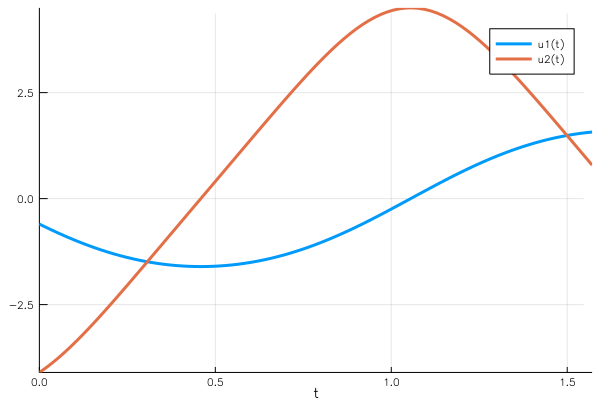

# Boundary Value Problems

This tutorial will introduce you to the functionality for solving BVPs. Other
introductions can be found by [checking out DiffEqTutorials.jl](https://github.com/JuliaDiffEq/DiffEqTutorials.jl). 

!!! note

    This tutorial assumes you have read the [Ordinary Differential Equations tutorial](@ref ode_example).

In this example we will solve the ODE that satisfies the boundary condition in the form of

```math
\begin{aligned}
\frac{du}{dt} &= f(t, u) \\
g(u) &= \vec{0}
\end{aligned}
```

## Example 1: Simple Pendulum

The concrete example that we are solving is the simple pendulum ``\ddot{u}+\frac{g}{L}u=0`` on the time interval ``t\in[0,\frac{\pi}{2}]``. First, we need to define the ODE

```julia
using BoundaryValueDiffEq
const g = 9.81
L = 1.0
tspan = (0.0,pi/2)
function simplependulum!(du,u,p,t)
    θ  = u[1]
    dθ = u[2]
    du[1] = dθ
    du[2] = -(g/L)*sin(θ)
end
```

### Boundary Condition

There are two problem types available:
 - A problem type for general boundary conditions `BVProblem` ( including conditions that may be anywhere/ everywhere on the integration interval ).
 - A problem type for boundaries that are specified at the beginning and the end of the integration interval `TwoPointBVProblem`

#### `BVProblem`

 The boundary conditions are specified by a function that calculates the residual in-place from the problem solution, such that the residual is $\vec{0}$ when the boundary condition is satisfied.

```julia
function bc1!(residual, u, p, t)
    residual[1] = u[end÷2][1] + pi/2 # the solution at the middle of the time span should be -pi/2
    residual[2] = u[end][1] - pi/2 # the solution at the end of the time span should be pi/2
end
bvp1 = BVProblem(simplependulum!, bc1!, [pi/2,pi/2], tspan)
sol1 = solve(bvp1, GeneralMIRK4(), dt=0.05)
plot(sol1)
```


The third argument of `BVProblem`  is the initial guess of the solution, which is constant in this example. <!-- add examples of more general initial conditions -->
We need to use `GeneralMIRK4` or `Shooting` methods to solve `BVProblem`. `GeneralMIRK4` is a collocation method, whereas `Shooting` treats the problem as an IVP and varies the initial conditions until the boundary conditions are met.
If you can have a good initial guess, `Shooting` method works very well.

```julia
using OrdinaryDiffEq
u₀_2 = [-1.6, -1.7] # the initial guess
function bc3!(residual, sol, p, t)
    residual[1] = sol(pi/4)[1] + pi/2 # use the interpolation here, since indexing will be wrong for adaptive methods
    residual[2] = sol(pi/2)[1] - pi/2
end
bvp3 = BVProblem(simplependulum!, bc3!, u₀_2, tspan)
sol3 = solve(bvp3, Shooting(Vern7()))
```
The initial guess can also be supplied via a function of `t` or a previous solution type, this is espacially handy for parameter analysis.
We changed `u` to `sol` to emphasize the fact that in this case the boundary condition can be written on the solution object. Thus all of the features on the solution type such as interpolations are available when using the `Shooting` method (i.e. you can have a boundary condition saying that the maximum over the interval is `1` using an optimization function on the continuous output). Note that user has to import the IVP solver before it can be used. Any common interface ODE solver is acceptable.

```julia
plot(sol3)
```



#### `TwoPointBVProblem`

Defining a similar problem as `TwoPointBVProblem` is shown in the following example. At the moment `MIRK4` is the only solver for `TwoPointBVProblem`s.

```julia
function bc2!(residual, u, p, t) # u[1] is the beginning of the time span, and u[end] is the ending
    residual[1] = u[1][1] + pi/2 # the solution at the beginning of the time span should be -pi/2
    residual[2] = u[end][1] - pi/2 # the solution at the end of the time span should be pi/2
end
bvp2 = TwoPointBVProblem(simplependulum!, bc2!, [pi/2,pi/2], tspan)
sol2 = solve(bvp2, MIRK4(), dt=0.05) # we need to use the MIRK4 solver for TwoPointBVProblem
plot(sol2)
```
Note that `u` is a tuple of `( u[1], u[end] )` just like `t` is `( t[1], t[end] )` and `p` holds the parameters of the given problem.


