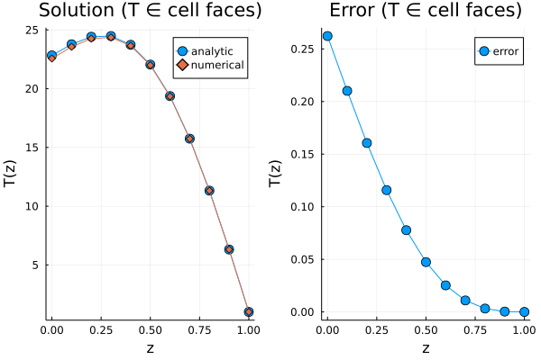

# Solving the heat equation with diffusion-implicit time-stepping.

In this tutorial, we'll be solving the heat equation:

```math
∂_t T = α ∇²(T) + β \sin(γ z)
```

with boundary conditions: ``∇T(z=a) = ∇T_{bottom}, T(z=b) = T_{top}``. We'll solve these equations on cell faces, rather than cell centers. The same exercise could easily be done on cell centers.

First, we'll use / import some packages:

```julia
import Plots
using LinearAlgebra
using DiffEqBase
using OrdinaryDiffEq: SplitODEProblem, solve, IMEXEuler
import SciMLBase
```

Next, we'll define some global problem parameters:
```julia
a,b, n = 0, 1, 10               # zmin, zmax, number of cells
n̂_min, n̂_max = -1, 1            # Outward facing unit vectors
α = 100;                        # thermal diffusivity, larger means more stiff
β, γ = 10000, π;                # source term coefficients
Δt = 1000;                      # timestep size
N_t = 10;                       # number of timesteps to take
FT = Float64;                   # float type
Δz = FT(b-a)/FT(n)
Δz² = Δz^2;
∇²_op = [1/Δz², -2/Δz², 1/Δz²]; # interior Laplacian operator
∇T_bottom = 10;                 # Temperature gradient at the top
T_top = 1;                      # Temperature at the bottom
S(z) = β*sin(γ*z)               # source term, (sin for easy integration)
zf = range(a, b, length=n+1);   # coordinates on cell faces
```

## Derivation of analytic solution
Here, we'll derive the analytic solution:

```math
\frac{∂²T}{∂²z} = -S(z)/α = -β \sin(γ z)/α \\
\frac{∂T}{∂z} = β \cos(γ z)/(γ α)+c_1 \\
T(z) = β \sin(γ z)/(γ^2 α)+c_1 z+c_2, \qquad \text{(generic solution)}
```
Apply bottom boundary condition:
```math
\frac{∂T}{∂z}(a) = β \cos(γ a)/(γ α)+c_1 = ∇T_{bottom} \\
c_1 = ∇T_{bottom}-β \cos(γ a)/(γ α)
```

Apply top boundary condition:
```math
T(b) = β \sin(γ b)/(γ^2 α)+c_1 b+c_2 = T_{top} \\
c_2 = T_{top}-(β \sin(γ b)/(γ^2 α)+c_1 b)
```

And now let's define this in a julia function:
```julia
function T_analytic(z) # Analytic steady state solution
    c1 = ∇T_bottom-β*cos(γ*a)/(γ*α)
    c2 = T_top-(β*sin(γ*b)/(γ^2*α)+c1*b)
    return β*sin(γ*z)/(γ^2*α)+c1*z+c2
end
```

Here, we'll derivation the matrix form of the temporal discretization we wish to use (diffusion-implicit and explicit Euler):
```math
∂_t T = α ∇²T + S \\
(T^{n+1}-T^n) = Δt (α  ∇²T^{n+1} + S) \\
(T^{n+1} - Δt α ∇²T^{n+1}) = T^n + Δt S \\
(I - Δt α ∇²) T^{n+1} = T^n + Δt S
```

Using the following index denotion:

 - `i` first interior index
 - `b` boundary index
 - `g` ghost index

we'll derive the Dirichlet boundary stencil & source:
```math
∂_t T = α (T[i-1]+T[b]-2 T[i])/Δz² + S \\
∂_t T = α (T[i-1]-2 T[i])/Δz² + S + α T[b] / Δz²
```

and Neumann boundary stencil & source:
```math
∇T_{bottom} n̂ = (T[g] - T[i])/(2Δz), \qquad    n̂ = [-1,1] ∈ [zmin,zmax] \\
T[i] + 2 Δz ∇T_{bottom} n̂ = T[g] \\
∂_t T = α (((T[i] + 2 Δz ∇T_{bottom} n̂) - T[b])/Δz - (T[b] - T[i])/Δz)/Δz + S \\
∂_t T = α (((T[i]) - T[b])/Δz - (T[b] - T[i])/Δz)/Δz + S + α 2 Δz ∇T_{bottom} n̂/Δz² \\
∂_t T = α (2 T[i] - 2 T[b])/Δz² + S + 2α ∇T_{bottom} n̂/Δz
```

## Define the discrete diffusion operator
```julia
∇² = Tridiagonal(
    ones(FT, n) .* ∇²_op[1],
    ones(FT, n+1)   .* ∇²_op[2],
    ones(FT, n) .* ∇²_op[3]
);

# Modify boundary stencil to account for BCs

∇².d[1] = -2/Δz²
∇².du[1] = +2/Δz²

# Modify boundary stencil to account for BCs
∇².du[n] = 0  # modified stencil
∇².d[n+1] = 0 # to ensure `∂_t T = 0` at `z=zmax`
∇².dl[n] = 0  # to ensure `∂_t T = 0` at `z=zmax`
D = α .* ∇²
```

## Compute boundary source
Here, we'll compute the boundary source (``α T[b] / Δz²``)
```julia
AT_b = zeros(FT, n+1);
AT_b[1] = α*2/Δz*∇T_bottom*n̂_min;
AT_b[end-1] = α*T_top/Δz²;
```

## Set initial condition
Let's just initialize the solution to `1`, and also set the top boundary condition:
```julia
T = zeros(FT, n+1);
T .= 1;
T[n+1] = T_top # set top BC
```

## Define right-hand side sources
Here, we define the right-hand side (RHS) sources:
```julia
function rhs!(dT, T, params, t)
    n = params.n
    i = 1:n # interior domain
    dT[i] .= S.(zf[i]) .+ AT_b[i]
    return dT
end
```

Next, we'll pacakge up parameters needed in the RHS function, define the ODE problem, and solve.
```julia
params = (;n)

tspan = (FT(0), N_t*FT(Δt))

prob = SplitODEProblem(
    SciMLBase.DiffEqArrayOperator(
        D,
    ),
    rhs!,
    T,
    tspan,
    params
)
alg = IMEXEuler(linsolve=LinSolveFactorize(lu!))
println("Solving...")
sol = solve(
    prob,
    alg,
    dt = Δt,
    saveat = range(FT(0), N_t*FT(Δt), length=5),
    progress = true,
    progress_message = (dt, u, p, t) -> t,
);
```

# Visualizing results

Now, let's visualize the results of the solution and error:
```julia
T_end = sol.u[end]

p1 = Plots.plot(zf, T_analytic.(zf), label="analytic", markershape=:circle, markersize=6)
p1 = Plots.plot!(p1, zf, T_end, label="numerical", markershape=:diamond)
p1 = Plots.plot!(p1, title="T ∈ cell faces")

p2 = Plots.plot(zf, abs.(T_end .- T_analytic.(zf)), label="error", markershape=:circle, markersize=6)
p2 = Plots.plot!(p2, title="T ∈ cell faces")

Plots.plot(p1, p2)
```

