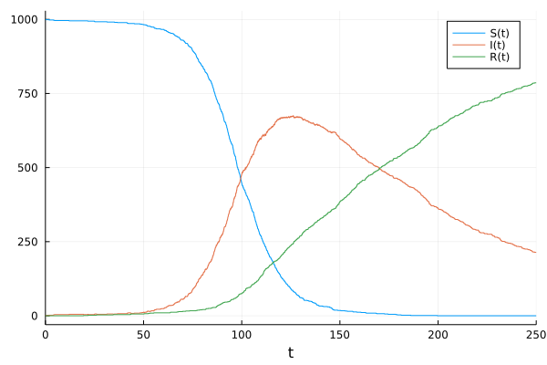

# Continuous-Time Jump Processes 

In this tutorial we will describe how to define and simulate continuous-time
jump processes, also known in biological fields as stochastic chemical kinetics
(i.e. Gillespie) models. 

!!! note

    This tutorial assumes you have read the [Ordinary Differential Equations tutorial](@ref ode_example). 

The discrete stochastic simulations we consider are a form of jump equation with
a "trivial" (non-existent) differential equation. We will first demonstrate how
to build these types of models using the biological modeling functionality of
[Catalyst.jl](https://github.com/SciML/Catalyst.jl), then describe how to build
them directly and more generally using
[DiffEqJump.jl](https://github.com/SciML/DiffEqJump.jl) jump types, and finally
show how to couple discrete stochastic simulations to differential equation
models.

## Illustrative Model: SIR disease dynamics
To illustrate the jump process solvers, we will build an SIR model which matches
the tutorial from [Gillespie.jl](https://github.com/sdwfrost/Gillespie.jl). SIR
stands for susceptible, infected, and recovered, and is a model of disease
spread. When a susceptible person comes in contact with an infected person, the
disease has a chance of infecting the susceptible person. This "chance" is
determined by the number of susceptible persons and the number of infected
persons, since in larger populations there is a greater chance that two people
come into contact. Every infected person will in turn have a rate at which they
recover. In our model we'll assume there are no births or deaths, and a
recovered individual is protected from reinfection.

We'll begin by giving the mathematical equations for the jump processes of the
number of susceptible (``S(t)``), number of infected (``I(t)``), and number of
recovered (``R(t)``). In the next section we give a more intuitive and
biological description of the model for users that are less familiar with jump
processes. Let ``Y_i(t)``, ``i = 1,2``, denote independent unit Poisson
processes. Our basic mathematical model for the evolution of
``(S(t),I(t),R(t))``, written using Kurtz's time-change representation, is then

```math
\begin{aligned}
S(t) &= S(0) - Y_1\left(  \int_0^t \beta S(s^{-}) I(s^{-}) \, ds\right) \\
I(t) &= I(0) + Y_1\left(  \int_0^t \beta S(s^{-}) I(s^{-}) \, ds\right) 
        - Y_2 \left( \int_0^t \nu I(s^-)  \, ds \right) \\
R(t) &= R(0) + Y_2 \left( \int_0^t \nu I(s^-)  \, ds \right)
\end{aligned}
```
Notice, our model involves two jumps with rate functions, also known as
intensities or propensities, given by ``\beta S(t) I(t)`` and ``\nu I(t)``
respectively. These model the infection of susceptible individuals and recovery
of infected individuals.

## Defining the SIR Model using Reactions via Catalyst
For those less-familiar with the time-change representation, we now give a more
intuitive explanation of the model, and then demonstrate how it can be written
as a serious of chemical reactions in
[Catalyst.jl](https://github.com/SciML/Catalyst.jl) and seamlessly converted
into a form that can be used with the
[DiffEqJump.jl](https://github.com/SciML/DiffEqJump.jl) solvers. Users
interested in how to directly define jumps using the lower-level DiffEqJump
interface can skip to [Building and Simulating the Jump Process using the
DiffEqJump Low-level Interface](@ref).

The SIR model described above involves two basic chemical reactions,

```math
\begin{aligned}
S + I &\overset{\beta}{\to} 2 I \\
I &\overset{\nu}{\to} R,
\end{aligned}
```

where ``\beta`` and ``\nu`` are the rate constants of the reactions (with units
of probability per time). In a jump process (stochastic chemical kinetics)
model, we keep track of the non-negative integer number of each species at each
time (i.e. ``(S(t), I(t), R(t))`` above). Each reaction has an associated rate
function (i.e. intensity or propensity) giving the probability per time it can
occur when the system is in state ``(S(t),I(t),R(t))``:

```math
\begin{matrix}
\text{Reaction} & \text{Rate Functions} \\
\hline
S + I \overset{\beta}{\to} 2 I & \beta S(t) I(t) \\
I \overset{\nu}{\to} R & \nu I(t).
\end{matrix}
```

``\beta`` is determined by factors like the type of the disease. It can be
interpreted as the probability per time one pair of susceptible and infected
people encounter each other, with the susceptible person becoming sick. The
overall rate (i.e. probability per time) that some susceptible person gets sick
is then given by the rate constant multiplied by the number of possible pairs of
susceptible and infected people. This formulation is known as the [law of mass
action](https://en.wikipedia.org/wiki/Law_of_mass_action). Similarly, we have
that each individual infected person is assumed to recover with probability per
time ``\nu``, so that the probability per time *some* infected person becomes
recovered is ``\nu`` times the number of infected people, i.e. ``\nu I(t)``. 

Rate functions give the probability per time for each of the two types of jumps
to occur, and hence determine when the state of our system changes. To fully
specify our model we also need to specify how the state changes when a jump
occurs, giving what are called `affect` functions in DiffEqJump. For example,
when the $S + I \to 2 I$ reaction occurs and some susceptible person becomes
infected, the subsequent (instantaneous) state change is that

```math
\begin{aligned}
S &\to S - 1 & I &\to I + 1.
\end{aligned}
```

Likewise, when the $I \to R$ reaction occurs so that some infected person becomes
recovered the state change is

```math
\begin{aligned}
I &\to I - 1 & R \to R + 1.
\end{aligned}
```

Using [Catalyst.jl](https://github.com/SciML/Catalyst.jl) we can input our full
reaction network in a form that can be easily used with DiffEqJump's solvers:
```julia
# ]add Catalyst
using Catalyst
sir_model = @reaction_network begin
    β, S + I --> 2I
    ν, I --> R
end β ν
```

Notice that the order the variables are introduced in the model is `S`, then
`I`, then `R`, and thus this is the canonical ordering of the variables.

## Building and Simulating the Jump Process from Catalyst Models

First, we have to define some kind of differential equation that we can "solve"
to simulate the jump process. Since we want integer, discrete changes in the
numbers of the different types of people, we will build a `DiscreteProblem`. We
do this by giving the constructor `u0`, the initial condition, and `tspan`, the
timespan. Here, we will start with `999` susceptible people, `1` infected
person, and `0` recovered people, and solve the problem from `t=0.0` to
`t=250.0`. We use the parameters `β = 0.1/1000` and `ν = 0.01`. Thus we build
the problem via:

```julia
p     = (0.1/1000,0.01)   
u₀    = [999,1,0]
tspan = (0.0,250.0)
prob  = DiscreteProblem(sir_model, u₀, tspan, p)
```
*Notice, the initial populations are integers since we want the exact number of
people in the different states.*

The Catalyst reaction network can be converted into various
DifferentialEquations.jl problem types, including `JumpProblem`s, `ODEProblem`s,
or `SDEProblem`s. To turn it into a jump problem representing the SIR jump
process model, we load DiffEqJump and simply do:

```julia
using DiffEqJump
jump_prob = JumpProblem(sir_model, prob, Direct())
```
Here `Direct()` indicates that we will determine the random times and types of
reactions using [Gillespie's Direct stochastic simulation algorithm
(SSA)](https://doi.org/10.1016/0021-9991(76)90041-3). See [Constant Rate Jump
Aggregators](@ref) below for other supported SSAs.

We now have a problem that can be evolved in time using the DiffEqJump solvers.
Since our model is a pure jump process (no continuously-varying components), we
will use `SSAStepper()` to handle time-stepping the `Direct` method from jump to
jump:

```julia
sol = solve(jump_prob, SSAStepper())
```

This solve command takes the standard commands of the common interface, and the
solution object acts just like any other differential equation solution. Thus
there exists a plot recipe, which we can plot with:

```julia
using Plots; plot(sol)
```



## Building and Simulating the Jump Process using the DiffEqJump Low-level Interface
We now show how to directly use DiffEqJump's low-level interface to construct
and solve our jump process model for ``(S(t),I(t),R(t))``. Each individual jump
that can occur is represented through specifying two pieces of information; a
`rate` function (i.e. intensity or propensity) for the jump and an `affect`
function for the jump. The former gives the probability per time a particular
jump can occur given the current state of the system, and hence determines the
time at which jumps can happen. The later specifies the instantaneous change in
the state of the system when the jump occurs. 

In our SIR model we have two possible jumps that can occur (one for susceptibles
becoming infected and one for infected becoming recovered), with the
corresponding (mathematical) rates and affects given by
```math
\begin{matrix}
\text{Rates} & \text{Affects}\\
\hline 
\beta S(t) I(t) & S \to S - 1,\, I \to I + 1 \\
\nu I(t) & I \to I - 1, \, R \to R + 1.
\end{matrix}
```

DiffEqJump offers three different ways to represent jumps: `MassActionJump`,
`ConstantRateJump`, and `VariableRateJump`. Choosing which to use is a trade off
between the desired generality of the `rate` and `affect` functions vs. the
computational performance of the resulting simulated system. In general

| Jump Type          | Performance     | Generality |
|:----------:        | :----------:    |:------------:|
| [`MassActionJump`](@ref MassActionJumpSect) | Fastest | Restrictive rates/affects |
| [`ConstantRateJump`](@ref ConstantRateJumpSect) | Somewhat Slower | Much more general  |
| [`VariableRateJump`](@ref VariableRateJumpSect) | Slowest | Completely general |

It is recommended to try to encode jumps using the most performant option that
supports the desired generality of the underlying `rate` and `affect` functions.
Below we describe the different jump types, and show how the SIR model can be
formulated using first `ConstantRateJump`s and then `MassActionJump`s
(`VariableRateJump`s are considered later).

## [Defining the Jumps Directly: `ConstantRateJump`](@id ConstantRateJumpSect)
The constructor for a `ConstantRateJump` is:

```julia
jump = ConstantRateJump(rate, affect!)
```

where `rate` is a function `rate(u,p,t)` and `affect!` is a function of the
integrator `affect!(integrator)` (for details on the integrator, see the
[integrator interface docs](@ref integrator)). Here `u` corresponds to the
current state of the system; for our SIR model `u[1]=S(t)`, `u[2]=I(t)` and
`u[3]=R(t)`. `p` corresponds to the parameters of the model, just as used for
passing parameters to derivative functions in ODE solvers. Thus, to define the
two possible jumps for our model we take (with `β=.1/1000.0` and `ν=.01`).

```julia
using DiffEqJump
β = 0.1 / 1000.0; ν = .01;
p = (β,ν)
rate1(u,p,t) = p[1]*u[1]*u[2]  # β*S*I
function affect1!(integrator)
  integrator.u[1] -= 1         # S -> S - 1
  integrator.u[2] += 1         # I -> I + 1
end
jump = ConstantRateJump(rate1,affect1!)

rate2(u,p,t) = p[2]*u[2]      # ν*I
function affect2!(integrator)
  integrator.u[2] -= 1        # I -> I - 1
  integrator.u[3] += 1        # R -> R + 1
end
jump2 = ConstantRateJump(rate2,affect2!)
```

We will start with `999` susceptible people, `1` infected person, and `0`
recovered people, and solve the problem from `t=0.0` to `t=250.0` so that
```julia
u₀    = [999,1,0]
tspan = (0.0,250.0)
```
*Notice, the initial populations are integers since we want the exact number of
people in the different states.*

Since we want integer, discrete changes in the numbers of the different types of
people, we will build a `DiscreteProblem`. 

```julia
prob = DiscreteProblem(u₀, tspan, p)
```

We can then use `JumpProblem` from DiffEqJump to augment the discrete problem
with jumps and select the stochastic simulation algorithm (SSA) to use in
sampling the jump processes. To create a `JumpProblem` we would simply do:

```julia
jump_prob = JumpProblem(prob, Direct(), jump, jump2)
```

Here `Direct()` indicates that we will determine the random times and types of
jumps that occur using [Gillespie's Direct stochastic simulation algorithm
(SSA)](https://doi.org/10.1016/0021-9991(76)90041-3). See [Constant Rate Jump
Aggregators](@ref) below for other supported SSAs.

We now have a problem that can be evolved in time using the DiffEqJump solvers.
Since our model is a pure jump process (no continuously-varying components), we
will use `SSAStepper()` to handle time-stepping the `Direct` method from jump to
jump:

```julia
sol = solve(jump_prob, SSAStepper())
```

This solve command takes the standard commands of the common interface, and the
solution object acts just like any other differential equation solution. Thus
there exists a plot recipe, which we can plot with:

```julia
using Plots; plot(sol)
```


Note, in systems with more than a few jumps (more than ~10), it can be
advantageous to use more sophisticated SSAs than `Direct`. For such systems it
is recommended to use `SortingDirect`, `RSSA` or `RSSACR`, see the list of
DiffEqJump SSAs at [Constant Rate Jump Aggregators](@ref).


### *Caution about Constant Rate Jumps*
`ConstantRateJump`s are quite general, but they do have one restriction. They
assume that the rate functions are constant at all times between two consecutive
jumps of the system. i.e. any species/states or parameters that the rate
function depends on must not change between the times at which two consecutive
jumps occur. Such conditions are violated if one has a time dependent parameter
like ``\beta(t)`` or if some of the solution components, say `u[2]`, may also
evolve through a coupled ODE or SDE (see below for examples). For problems where
the rate function may change between consecutive jumps, `VariableRateJump`s must
be used.

Thus in the examples above,

```julia
rate1(u,p,t) = p[1]*u[1]*u[2]
rate2(u,p,t) = p[2]*u[2]
```

both must be constant other than changes due to some other `ConstantRateJump` or
`MassActionJump` (the same restriction applies to `MassActionJump`s). Since
these rates only change when `u[1]` or `u[2]` is changed, and `u[1]` and `u[2]`
only change when one of the jumps occur, this setup is valid. However, a rate of
`t*p[1]*u[1]*u[2]` would not be valid because the rate would change during the
interval, as would `p[2]*u[1]*u[4]` when `u[4]` is the solution to a
continuous problem such as an ODE or SDE. Thus one must be careful about to
follow this rule when choosing rates.

If your problem must have the rates depend on a continuously changing quantity,
you need to use the `VariableRateJump`.

## SSAStepper

Any common interface algorithm can be used to perform the time-stepping since it
is implemented over the callback interface. This allows for hybrid systems that
mix ODEs, SDEs and jumps. In many cases we may have a pure jump system that only
involves `ConstantRateJump`s and/or `MassActionJump`s (see below). When that's
the case, a substantial performance benefit may be gained by using
`SSAStepper()`. Note, `SSAStepper` is a more limited time-stepper which only
supports discrete events, and does not allow simultaneous coupled ODEs or SDEs.
It is, however, very efficient for pure jump problems.

## Reducing Memory Use: Controlling Saving Behavior

Note that jumps act via the callback interface which defaults to saving at each
event. The reason is because this is required in order to accurately resolve
every discontinuity exactly (and this is what allows for perfectly vertical
lines in plots!). However, in many cases when using jump problems you may wish
to decrease the saving pressure given by large numbers of jumps. To do this, you
set `save_positions` in the `JumpProblem`. Just like for other callbacks, this
is a tuple `(bool1,bool2)` which sets whether to save before or after a jump. If
we do not want to save at every jump, we would thus pass:

```julia
jump_prob = JumpProblem(prob, Direct(), jump, jump2, save_positions=(false,false))
```

Now the saving controls associated with the integrator are the only ones to note.
For example, we can use `saveat=0.5` to save at an evenly spaced grid:

```julia
sol = solve(jump_prob, SSAStepper(), saveat=0.5)
```


## [Defining the Jumps Directly: `MassActionJump`](@id MassActionJumpSect)
For jumps that can be represented as mass action reactions, a further
specialization of the jump type is possible that offers improved computational
performance; `MassActionJump`. Suppose the system has ``N`` chemical species
``\{S_1,\dots,S_N\}``. A general mass action reaction has the form

```math
R_1 S_1 + R_2 S_2 + \dots + R_N S_N \overset{k}{\rightarrow} P_1 S_1 + P_2 S_2 + \dots + P_N S_N
```
where the non-negative integers ``(R_1,\dots,R_N)`` denote the *reactant
stoichiometry* of the reaction, and the non-negative integers
``(P_1,\dots,P_N)`` the *product stoichiometry*. The *net stoichiometry* is
the net change in each chemical species from the reaction occurring one time,
given by ``(P_1-R_1,\dots,P_N-R_N)``.

As an example, consider again the SIR model defined in the `@reaction_network`
above. The species are then `(S,I,R)`. The first reaction has rate `β`,
reactant stoichiometry `(1,1,0)`, product stoichiometry `(0,2,0)`, and net
stoichiometry `(-1,1,0)`. The second reaction has rate `ν`, reactant
stoichiometry `(0,1,0)`, product stoichiometry `(0,0,1)`, and net stoichiometry
`(0,-1,1)`.

We can manually encode this system as a mass action jump by specifying the
indexes of the rate constants in `p`, the reactant stoichiometry, and the net
stoichiometry as follows:
```julia
rateidxs = [1, 2]    # i.e. [β,ν]
reactant_stoich =
[
  [1 => 1, 2 => 1],         # 1*S and 1*I
  [2 => 1]                  # 1*I
]
net_stoich =
[
  [1 => -1, 2 => 1],        # -1*S and 1*I
  [2 => -1, 3 => 1]         # -1*I and 1*R
]
mass_act_jump = MassActionJump(reactant_stoich, net_stoich; param_idxs=rateidxs)
```
Just like for `ConstantRateJumps`, to then simulate the system we create
a `JumpProblem` and call `solve`:
```julia
jump_prob = JumpProblem(prob, Direct(), mass_act_jump)
sol = solve(jump_prob, SSAStepper())
```

Note, for chemical reaction systems, Catalyst.jl automatically groups reactions
into their optimal jump representation.


## Defining the Jumps Directly: Mixing `ConstantRateJump` and `MassActionJump`
Suppose we now want to add in to the SIR model another jump that can not be
represented as a mass action reaction. We can create a new `ConstantRateJump`
and simulate a hybrid system using both the `MassActionJump` for the two
previous reactions, and the new `ConstantRateJump`. Let's suppose we want to let
susceptible people be born with the following jump rate:
```julia
birth_rate(u,p,t) = 10.0*u[1]/(200. + u[1]) + 10.
function birth_affect!(integrator)
  integrator.u[1] += 1
end
birth_jump = ConstantRateJump(birth_rate, birth_affect!)
```
We can then simulate the hybrid system as
```julia
jump_prob = JumpProblem(prob, Direct(), mass_act_jump, birth_jump)
sol = solve(jump_prob, SSAStepper())
```


## Adding Jumps to a Differential Equation

If we instead used some form of differential equation instead of a
`DiscreteProblem`, we would couple the jumps/reactions to the differential
equation. Let's define an ODE problem, where the continuous part only acts on
some new 4th component:

```julia
using OrdinaryDiffEq
function f(du,u,p,t)
  du[4] = u[2]*u[3]/100000 - u[1]*u[4]/100000
end
u₀   = [999.0,1.0,0.0,100.0]
prob = ODEProblem(f,u₀,tspan,p)
```

Notice we gave the 4th component a starting value of 100.0, and used floating
point numbers for the initial condition since some solution components now
evolve continuously. The same steps as above will allow us to solve this hybrid
equation when using `ConstantRateJumps` (or `MassActionJump`s). For example, we
can solve it using the `Tsit5()` method via:

```julia
jump_prob = JumpProblem(prob,Direct(),jump,jump2)
sol = solve(jump_prob,Tsit5())
```


## [Adding a VariableRateJump](@id VariableRateJumpSect)

Now let's consider adding a reaction whose rate changes continuously with the
differential equation. To continue our example, let's let there be a new
jump/reaction with rate depending on `u[4]`

```julia
rate3(u,p,t) = 1e-2*u[4]
function affect3!(integrator)
  integrator.u[2] += 1
end
jump3 = VariableRateJump(rate3,affect3!)
```

Notice, since `rate3` depends on a variable that evolves continuously, and hence
is not constant between jumps, we must use a `VariableRateJump`.

Solving the equation is exactly the same:

```julia
u₀   = [999.0,1.0,0.0,1.0]
prob = ODEProblem(f,u₀,tspan,p)
jump_prob = JumpProblem(prob,Direct(),jump,jump2,jump3)
sol = solve(jump_prob,Tsit5())
```


*Note that `VariableRateJump`s require a continuous problem, like an
ODE/SDE/DDE/DAE problem.*

Lastly, we are not restricted to ODEs. For example, we can solve the same jump
problem except with multiplicative noise on `u[4]` by using an `SDEProblem`
instead:

```julia
using StochasticDiffEq
function g(du,u,p,t)
  du[4] = 0.1u[4]
end

prob = SDEProblem(f,g,[999.0,1.0,0.0,1.0],(0.0,250.0), p)
jump_prob = JumpProblem(prob,Direct(),jump,jump2,jump3)
sol = solve(jump_prob,SRIW1())
```


## RegularJumps and Tau-Leaping

The previous parts described how to use `ConstantRateJump`s, `MassActionJump`s,
and `VariableRateJump`s to add jumps to differential equation algorithms over
the callback interface. However, in many cases you do not need to step to every
jump time. Instead, regular jumping allows you to pool together jumps and
perform larger updates in a statistically-correct but more efficient manner.

For `RegularJump`s, we pool together the jumps we wish to perform. Here our
`rate` is a vector equation which computes the rates of each jump process
together:

```julia
function rate(out,u,p,t)
    out[1] = (0.1/1000.0)*u[1]*u[2]
    out[2] = 0.01u[2]
end
```

and then we compute the total change matrix `c`

```julia
function c(dc,u,p,t,mark)
    dc[1,1] = -1
    dc[2,1] = 1
    dc[2,2] = -1
    dc[3,2] = 1
end
```

where each column is a different jump process. We then declare the form of `dc`
and build a `RegularJump`:

```julia
dc = zeros(3,2)
rj = RegularJump(rate,c,dc;constant_c=true)
```

From there we build a `JumpProblem`:

```julia
prob = DiscreteProblem([999.0,1.0,0.0],(0.0,250.0))
jump_prob = JumpProblem(prob,Direct(),rj)
```

Note that when a `JumpProblem` has a `RegularJump`, special algorithms are
required. This is detailed on
[the jump solvers page](@ref jump_solve).
One such algorithm is `SimpleTauLeaping`, which we use as follows:

```julia
sol = solve(jump_prob,SimpleTauLeaping();dt=1.0)
```

## FAQ

#### *1. When running many consecutive simulations, for example within an `EnsembleProblem` or loop, how can I update `JumpProblem`s?*

In [Remaking `JumpProblem`s](@ref) we show how to modify parameters, the initial
condition, and other components of a generated `JumpProblem`. This can be useful
when trying to call `solve` many times while avoiding reallocations of the
internal aggregators for each new parameter value or initial condition.

#### *2. How do I use callbacks with `ConstantRateJump` or `MassActionJump` systems?*

Callbacks can be used with `ConstantRateJump`s and `MassActionJump`s. When solving a pure jump system with `SSAStepper`, only discrete callbacks can be used (otherwise a different time stepper is needed). 

*Note, when modifying `u` or `p` within a callback, you must call `reset_aggregated_jumps!(integrator)` after making updates.* This ensures that the underlying jump simulation algorithms know to reinitialize their internal data structures. Leaving out this call will lead to incorrect behavior!

A simple example that uses a `MassActionJump` and changes the parameters at a specified time in the simulation using a `DiscreteCallback` is
```julia
using DiffEqJump
rs = [[1 => 1],[2=>1]]
ns = [[1 => -1, 2 => 1],[1=>1,2=>-1]]
p  = [1.0,0.0]
maj = MassActionJump(rs, ns; param_idxs=[1,2])
u₀ = [100,0]
tspan = (0.0,40.0)
dprob = DiscreteProblem(u₀,tspan,p)
jprob = JumpProblem(dprob,Direct(),maj)
pcondit(u,t,integrator) = t==20.0
function paffect!(integrator)
  integrator.p[1] = 0.0
  integrator.p[2] = 1.0
  reset_aggregated_jumps!(integrator)
end
sol = solve(jprob, SSAStepper(), tstops=[20.0], callback=DiscreteCallback(pcondit,paffect!))
```
Here at time `20.0` we turn off production of `u[2]` while activating production of `u[1]`, giving


#### *3. How can I define collections of many different jumps and pass them to `JumpProblem`?*

We can use `JumpSet`s to collect jumps together, and then pass them into
`JumpProblem`s directly. For example, using the `MassActionJump` and
`ConstantRateJump` defined earlier we can write
```
jset = JumpSet(mass_act_jump, birth_jump)
jump_prob = JumpProblem(prob, Direct(), jset)
sol = solve(jump_prob, SSAStepper())
```

#### *4. How can I set the random number generator used in the jump process sampling algorithms (SSAs)?*

Random number generators can be passed to `JumpProblem` via the `rng` keyword
argument. Continuing the previous example:

```julia
#] add RandomNumbers
using RandomNumbers
jprob = JumpProblem(dprob, Direct(), maj, rng=Xorshifts.Xoroshiro128Star(rand(UInt64)))
```
uses the `Xoroshiro128Star` generator from
[RandomNumbers.jl](https://github.com/JuliaRandom/RandomNumbers.jl).